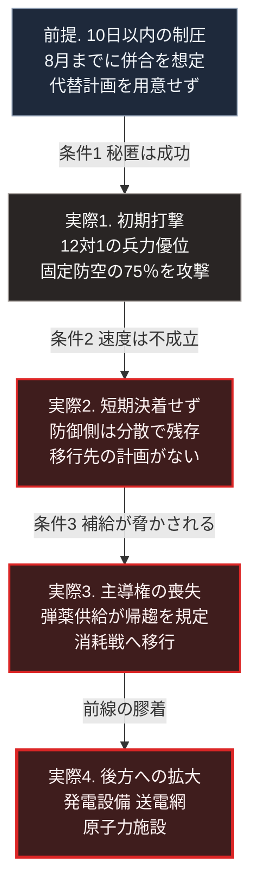

### 序論：本章が扱う範囲

本章は、2022年2月に始まったロシアによるウクライナ侵攻について、次の4点を整理します。

第一に、開戦に至った経緯と、当事者が公式に表明した理由。第二に、当初の作戦計画が想定していたことと、実際に生じたことの乖離。第三に、その乖離が何によって生じたか。第四に、この紛争において攻撃対象がどう変化したか。

本章の情報源は、国際機関の公表資料、および軍事研究機関が公表した分析報告に限定します。報道の引用は行いません。

なお、本章は戦況の逐次的な記述を目的としません。第Ⅰ部D-1およびD-4で整理した枠組みを、進行中の事例に適用することが目的です。

### 1. 経緯

2022年2月24日、ロシアはウクライナへの軍事行動を開始しました。

2022年3月2日、国際連合総会は緊急特別会期において、この行動を非難し、部隊の即時撤退を求める決議を採択しました [ [ 146 ] ](https://digitallibrary.un.org/record/3959039) 。同決議は141か国の賛成、5か国の反対、35か国の棄権で採択されています。

### 2. 当初計画と実際の乖離

英国の軍事研究機関である王立防衛安全保障研究所は、開戦から5か月間の作戦を分析した報告を公表しています [ [ 147 ] ](https://rusi.org/explore-our-research/publications/special-resources/preliminary-lessons-conventional-warfighting-russias-invasion-ukraine-february-july-2022) 。

同報告によれば、ロシア側の当初計画は、10日以内にウクライナを制圧し、8月までに併合を完了することを想定していました。

同報告が指摘する計画上の最大の欠陥は、代替の行動方針が用意されていなかった点です。首都の早期制圧が達成されなかった場合に移行すべき計画が存在せず、部隊はウクライナ側の動員が進むなかで消耗しました。

同報告はまた、欺瞞の効果について次のように分析しています。作戦の秘匿は成功し、首都の北方において12対1の兵力優位が達成されました。しかし、秘匿を優先した結果、実行を担う戦術部隊が事前に準備を整えられませんでした。

### 3. 乖離の要因

同報告の分析から、第Ⅰ部D-5で整理した4条件との対応関係を確認できます。

条件1、すなわち攻撃の位置と時期の秘匿については、達成されていました。

条件2、すなわち前進速度が防御側の対応速度を上回ることについては、達成されませんでした。ウクライナ側は分散配置によって初期打撃を生き延びています。同報告によれば、ロシア側は48時間以内に固定的な防空施設の75%を攻撃しましたが、分散した部隊は残存しました。

条件3、すなわち補給の追随については、決定的でした。同報告は、ウクライナ側が長距離火力によってロシア側の兵站を脅かしたときに、初めて主導権を奪ったと結論づけています。

同報告はまた、火力の比率が時間とともに変化したことを記録しています。開戦当初の砲兵の優位は2対1でしたが、6月には発射量で10対1に達しました。この変化は、初期の兵力比ではなく弾薬の供給能力が帰趨を規定したことを示します。

同報告は、精密誘導の意義について次の点を挙げています。精密であることは効果の効率を高めるだけでなく、必要な兵站の規模を縮小させます。

### 4. 攻撃対象の変化

この紛争において、攻撃対象は前線の部隊に限定されませんでした。

国際エネルギー機関は、2024年9月にウクライナのエネルギー安全保障に関する報告を公表しました [ [ 148 ] ](https://www.iea.org/reports/ukraines-energy-security-and-the-coming-winter) 。同報告によれば、2024年3月から5月の攻撃でウクライナはさらに9ギガワットの発電容量を失い、開戦前の容量の約3分の1が残るのみとなりました。

同機関は2025年10月22日に、続報を公表しています [ [ 307 ] ](https://www.iea.org/reports/ukraines-energy-security) 。同報告によれば、開戦後1年間の占領と破壊による発電容量の喪失は19ギガワットでした。2025年3月から9月の間には、攻撃による供給の途絶が3,100回を超えました。

国連の人権監視団は、2025年12月から2026年5月の期間について、エネルギー施設への攻撃に関する報告を公表しています [ [ 308 ] ](https://ukraine.ohchr.org/en/Attacks-against-Ukraine-s-energy-infrastructure-and-update-on-the-human-rights-situation-in-Ukraine-1-December-2025-31-May-2026) 。同報告は、2025年から2026年の冬季を通じてロシア軍がエネルギー施設を組織的かつ反復的に攻撃し、一時期には市民が1日に数時間しか電力を得られなかったと記述しています。

国際原子力機関は、ウクライナ国内の原子力施設の安全に関する情報を継続的に公表しています [ [ 149 ] ](https://www.iaea.org/newscenter/pressreleases) 。

国際連合人権高等弁務官事務所は、民間人の死傷に関する集計を公表しています [ [ 150 ] ](https://www.ohchr.org/en/countries/ukraine) 。2026年7月14日の公表によれば、2022年2月24日から2026年6月末までに確認された民間人の死者は16,431人、負傷者は48,613人です [ [ 309 ] ](https://ukraine.ohchr.org/en/Civilian-Casualties-Soar-in-Ukraine-in-the-First-Half-of-2026-Amid-Escalating-Attacks-and-Intensifying-Use-of-Deadly-Weapons-UN-Human-Rights-Monitors-Say) 。

第Ⅰ部D-4で整理したとおり、1977年の追加議定書第54条は文民の生存に不可欠な物への攻撃を禁じ、第56条は危険な力を内蔵する施設への攻撃を制限しています。エネルギー供給設備と原子力施設が攻撃または占拠の対象となった事実は、これらの規定に対する重大な論点を提起しています。

### 5. 無人機の主力化

この紛争では、無人機が主要な手段の1つとなりました。王立防衛安全保障研究所が2023年5月に公表した報告は、ウクライナ側の無人機の損耗が月におよそ1万機の水準にあると記述しています [ [ 310 ] ](https://www.rusi.org/explore-our-research/publications/special-resources/meatgrinder-russian-tactics-second-year-its-invasion-ukraine) 。同報告はまた、ロシア側の電子戦装備が前線10キロメートルごとに少なくとも1系統の密度で配置されていると記述しています。

前節で参照した国連の人権監視団は、2026年6月の民間人の死傷の大部分が短距離の無人機によるものであったと記述しています [ [ 309 ] ](https://ukraine.ohchr.org/en/Civilian-Casualties-Soar-in-Ukraine-in-the-First-Half-of-2026-Amid-Escalating-Attacks-and-Intensifying-Use-of-Deadly-Weapons-UN-Human-Rights-Monitors-Say) 。

月に1万機という損耗が継続しているという事実は、無人機が安価で大量に生産される手段であることを示します。この費用構造が防御側に対して持つ意味は、第Ⅱ部D-2で扱います。

### 🗺️ 図：想定と実際の乖離が生じた経路

計画の前提と、実際の経過を1本の連鎖として示します。

#### 図の読み方

この図は、上から下へ1本の縦の連鎖です。最上段が計画の前提、その下の4段が実際の経過です。段と段をつなぐ矢印には、第Ⅰ部D-5で整理した3条件の成否を記しています。

最上段の前提で決定的だったのは、兵力の不足ではありません。分析報告が指摘するとおり、初期の兵力比は攻撃側に有利でした。欠けていたのは、想定が外れた場合の代替計画です。

2段目への矢印が示すとおり、条件1の秘匿は達成されました。しかし3段目への矢印で、条件2が失われます。防御側の分散配置により、初期打撃で無力化できなかったためです。

4段目への矢印で、条件3が失われました。長距離火力が補給線を脅かしたことで、前進の持続が困難になりました。

最下段の実際4が、本書にとって最も重要です。前線が膠着したとき、攻撃は後方の供給基盤へ拡大しました。この移行には、明確な論理があります。前線で決着がつかない場合、相手の継戦能力を削ぐ手段として、その能力を支える基盤が標的となるためです。

第Ⅰ部D-4で述べたとおり、この種の攻撃を制限する規範は1949年および1977年に成文化されていました。その規範が存在するにもかかわらず、この事例では発電設備が繰り返し攻撃を受けています。

したがって、日本におけるインフラ設計の前提、すなわち「発電所や浄水場は攻撃対象とならない」という想定は、再検討を要する状態にあります。この論点は、第Ⅱ部C以降および第Ⅴ部で具体的に扱います。

---

### 現代社会構造への射程と本質（本章のまとめ）

本セクションは、著者による解釈です。前節までの記述とは区別して読んでください。

1.  **この事例が示していること**

    第一に、開戦の判断が短期決着の見積もりに依存していたこと。第二に、その見積もりが外れたこと。第三に、外れた場合の代替計画が用意されていなかったこと。

    この3点は、第Ⅰ部D-1で参照した枠組みにおける「私的情報と、それを偽る動機」の帰結として理解できます。当事者は自らの能力を過大に、相手の抵抗意思を過小に見積もりました。

2.  **本質**

    この紛争が示した構造的な帰結は、次のとおりです。短期決着が困難になった環境において、紛争は消耗戦となります。消耗戦においては、前線の戦闘力ではなく、後方の供給能力が帰趨を規定します。したがって、攻撃は後方の供給基盤へ向かいます。

    この連鎖は、当事者の意図とは独立に成立します。したがって、他の紛争においても同じ経過をたどる可能性があります。

3.  **日本にとっての含意**

    日本の生活基盤は、集約された大規模設備に依存しています。発電所、変電所、浄水場、そして通信の集約点です。これらは効率を基準に設計されており、攻撃対象となることを主要な設計条件としていません。

    第Ⅲ部では、この前提が崩れた場合の影響を評価します。第Ⅴ部では、集約型設備が長期にわたり機能を停止した状況において、局所的な供給を維持する設計を検討します。
