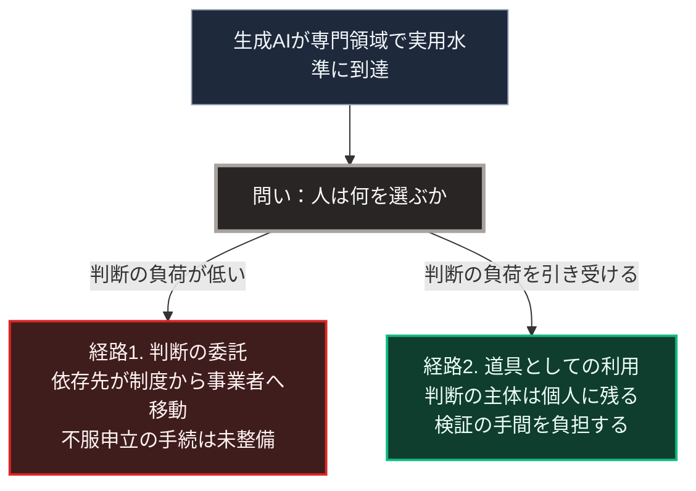

### 序論：本章が扱う範囲

本章は、生成AIの普及が社会構造にもたらす変化を、3つに分解して検討します。労働の構成、情報環境、そして依存対象の移行です。

前章の分類に従えば、普及そのものは区分A、すなわち進行中の変化です。一方、情報環境の機能不全は区分B、すなわち不連続な事象として扱います。

本章の前半は、観測された事実の記述です。後半は、それを前提とした推論です。両者の境界を明示します。

### 1. 労働の構成に関する観測

第Ⅰ部C-12で参照した研究によれば、顧客対応業務における生成AIの導入は、作業者の処理件数を平均で増加させました。同時に、効果の大きさは経験年数によって異なり、経験の浅い作業者において大きく、経験の長い作業者において小さいという分布が観測されています [ [ 118 ] ](https://www.nber.org/papers/w31161) 。

この分布が持つ含意は、従来の自動化と異なります。従来の自動化は、定型的な作業に従事する層へ影響が集中しました。今回観測された分布は、技能の水準そのものに作用する可能性を示唆します。

ここから先は推論です。

技能の習得は、多くの職種において、初級の作業を反復することによって進みます。初級の作業が自動化された場合、その反復の機会が失われます。この場合、上級の技能を持つ層は当面維持されます。一方で、その後継を育成できない状態が生じます。

この推論が妥当であれば、影響は雇用の総量ではなく、技能の世代間継承として現れます。そして、その影響が可視化されるまでには、現在の熟練層が退出するまでの時間、すなわち10年から20年を要します。

### 2. 情報環境に関する変化

生成AIは、文章、画像、音声を大量に生成できます。この能力は、情報環境に2つの変化をもたらします。

第一に、生成費用の低下です。特定の主張を支持する情報を大量に生成し流通させる費用が、大幅に低下します。

第二に、真偽の判定費用の上昇です。生成された情報が実在の記録と区別しにくい場合、受け手は個々の情報について検証を要します。

この2つが組み合わさると、次の状態が生じます。情報の生成側と検証側との間で、費用の非対称が拡大します。生成が安価で検証が高価であるとき、検証は現実的に実行されなくなります。

第Ⅰ部B-4で述べたとおり、民主的な意思決定は、参加者が共通の事実を前提とすることを条件とします。この条件が満たされない場合、討議は合意形成の機能を果たしません。

### 3. 依存対象の移行

3つ目の変化は、依存の対象に関するものです。

現在、多くの人は、行政手続、医療、法務、金融といった専門領域において、制度化された仲介者に依存しています。窓口、専門職、そして手続の体系です。

生成AIがこれらの領域で実用水準に達した場合、個人が直接に判断材料を得られるようになります。この変化は、しばしば「中央集権的な制度からの解放」として記述されます。

ここで検討すべきは、その記述が正確かどうかです。

依存が解消されるのではなく、依存先が移動している可能性があります。行政窓口への依存が、特定の事業者が提供する対話型システムへの依存に置き換わるだけであれば、依存の総量は変わりません。

さらに、両者には重要な差異があります。行政手続には、決定の根拠を開示し、不服を申し立てる制度が存在します。事業者が提供するシステムについて、同等の手続が保証されるとは限りません。

第Ⅰ部C-11で整理した構造が、ここでも当てはまります。分散設計は、明示的に規定した層でのみ分散を保証します。規定されなかった層では、経済的な誘因に従って構造が決まります。

### 4. 心理的な条件 ―― なぜ人は判断を委ねるのか

前節の移行が生じるかどうかは、技術の性能だけでは決まりません。人がどの程度、判断を外部へ委ねようとするかに依存します。

この論点に関する知見は、第Ⅲ部-6で詳述します。そこで参照するのは、フロムによる自由と不安の分析、カーネマンによる判断の2つの系の整理、サミュエルソンとゼックハウザーによる現状維持バイアスの実験、そしてフィスクとテイラーによる認知的な倹約家の概念です。

4つの知見は、判断の委託や現状維持を生む機序を、それぞれ異なる形で記述しています。本章の推論に必要なのは、それらに共通する帰結のみです。すなわち、判断を変える側に費用が偏るという点です。この帰結は、変えない選択肢が最適でない場合にも作用します。

### 🗺️ 図：依存の移行が生じる条件

技術の性能と、心理的な条件との関係を示します。

#### 図の読み方

この図が示すのは、技術の登場が経路を決めないという点です。決めるのは、どちらの経路の負荷が低いかです。

第Ⅲ部-6で整理する知見に照らせば、経路1の選ばれやすい条件が揃っています。判断を委ねることは負荷が低く、現状を変えないことは負荷が低く、検証を省くことは負荷が低いためです。

したがって、経路2を成立させるには、意識的な設計が必要になります。単に「利用者が主体的に判断すべきである」と述べることは、有効な設計ではありません。負荷の非対称が存在する限り、その呼びかけは実効性を持ちません。

ここから導かれる設計上の要請は、次のとおりです。経路2の負荷を、経路1の負荷に近づけること。すなわち、判断の主体を個人に残したまま、そのために要する手間を削減する仕組みです。

具体的には、判断の根拠が自動的に提示されること。参照した情報源へ即座に到達できること。そして、システムの動作を利用者が変更できること。これらが、負荷を下げる設計の方向性です。

この論点は、第Ⅴ部において、局所で動作する情報基盤の設計として具体化します。そこでの要件は、性能の最大化ではなく、判断の主体を利用者側に保持したまま負荷を下げることです。

---

### 本章の位置づけ

本セクションは、著者による解釈です。

1.  **事実と推論の境界**

    本章において事実として記述したのは、次のものです。生成AIの導入効果に関する観測結果。情報の生成費用と検証費用の非対称。そして、第Ⅲ部-6で詳述する社会心理学および行動経済学の既存の知見です。

    推論として記述したのは、技能の世代間継承に関する見通しと、依存対象の移行に関する見通しです。これらは、上記の事実から導かれる推論であり、観測された事実ではありません。

2.  **本章の主要な論点**

    本章が提示した最も重要な論点は、技術の性能が経路を決めないという点です。

    生成AIが十分に高性能であることは、人がそれに判断を委ねる条件でも、委ねない条件でもありません。決めるのは、それぞれの選択肢に伴う認知的な負荷です。

3.  **シナリオへの接続**

    第Ⅲ部の3つのシナリオにおいて、本章の論点は次のように反映されます。

    楽観シナリオでは、経路2を成立させる設計が普及し、生産性向上が人口減少を相殺します。

    ベースラインでは、経路1と経路2が混在し、領域によって異なる帰結が生じます。

    悲観シナリオでは、経路1が支配的となり、情報環境の機能不全が合意形成の能力を損ないます。
