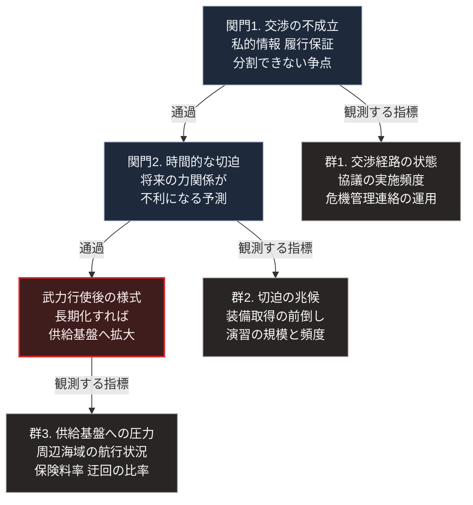

### 序論：本章が扱う範囲

本章は、日本の周辺地域における武力紛争のリスクを検討します。

本章は、特定の紛争が発生するとも、発生しないとも主張しません。[第Ⅲ部-1](future-method)で述べた方針に従い、根拠のない確率は提示しません。

代わりに検討するのは、[第Ⅰ部D-1](war-why-states-fight)で整理した開戦条件が、現在どの程度満たされているかです。そして、その状態を観測するための指標を定義します。

本章の情報源は、各国政府および国際機関が公表する文書に限定します。

### 1. 分析の枠組み

[第Ⅰ部D-1](war-why-states-fight)で整理した枠組みを再掲します。

摩擦が存在するだけでは、武力行使に至りません。次の2つの関門を通過する必要があります。

関門1は、交渉が機能しない条件です。私的情報と誇張の動機、合意の履行を保証する仕組みの欠如、そして争点が分割できないこと。この3つのいずれかが成立すると、交渉による解決点が特定できません。

関門2は、時間的な切迫です。将来の力関係が現在より不利になるという予測が成立したとき、待機する選択が不利になります。

本章では、この2つの関門について、現在の状態を評価します。

### 2. 関門1に関する現状

**私的情報と誇張の動機**

各国は、自国の軍事能力について詳細な情報を公表していません。同時に、抑止の効果を高めるため、能力を実際より高く印象づける動機を持ちます。

この状態は、歴史的に常態です。ただし、近年2つの変化が生じています。

第一に、商用衛星画像と公開情報の分析により、部隊の配置や設備の建設が第三者にも観測可能になりました。これは私的情報の範囲を縮小させます。

第二に、サイバー領域における攻撃は、実行主体の特定に時間を要します。これは、新たな私的情報の領域を拡大させます。

したがって、この条件については、縮小と拡大が同時に進行しています。

**履行保証の欠如**

国際的な合意の履行を強制する仕組みは、限定的です。国際連合安全保障理事会は、常任理事国の拒否権により、当事国が関与する事案において機能しない場合があります [ [ 151 ] ](https://www.un.org/securitycouncil/) 。

[第Ⅱ部A-5](usa-current-state)で述べたとおり、同盟関係に基づく保証についても、相手方の政策継続性という不確実性があります。

**争点の分割可能性**

日本の周辺には、領域の帰属をめぐる複数の懸案が存在します。日本政府は、これらに関する立場を外交青書等で公表しています [ [ 157 ] ](https://www.mofa.go.jp/mofaj/gaiko/bluebook/) 。

領域の帰属は、[第Ⅰ部D-1](war-why-states-fight)で整理した分類において、分割が困難な争点に該当します。

### 3. 関門2に関する現状

関門2で作用するのは、将来の力関係に関する予測です。

この予測の入力となる要素には、次のものが含まれます。

**人口動態**：[第Ⅱ部A-7](china-current-state)で示したとおり、中国の総人口は減少局面にあり、65歳以上の割合は15.9%です。日本については、65歳以上が29.3%です。労働力人口の推移は、長期の経済規模と防衛支出の余力に影響します。

**経済規模**：第Ⅱ部A-7で示したとおり、中国の2025年の国内総生産は140兆1,879億元、前年比5.0%増です。

**財政の余力**：[第Ⅱ部A-5](usa-current-state)で示したとおり、アメリカの市中保有債務は2026年の国内総生産比101%から2036年に120%へ上昇する見通しです。

これらの要素は、いずれも公表されている数値です。ただし、当事者がこれらをどう解釈するかは、公表されていません。

[第Ⅰ部D-1](war-why-states-fight)で述べたとおり、開戦の判断に作用するのは客観的な力関係ではなく、当事者が持つ将来予測です。したがって、これらの数値から直ちに結論を導くことはできません。

### 4. 紛争が発生した場合の様式

[第Ⅰ部D-5](war-blitzkrieg-doctrine)および[第Ⅱ部B-1](report-ukraine-war)で整理したとおり、現在の技術環境において短期決着の成立条件は満たされにくくなっています。

したがって、仮に武力行使が発生した場合、次の経過が想定されます。

第一に、短期決着を意図した作戦が実施されます。第二に、第Ⅰ部D-5の条件1（秘匿）と条件2（速度）が監視技術により満たされない環境では、その作戦は想定どおりに進みにくくなります。第三に、その場合、紛争は長期化しえます。第四に、攻撃対象が後方の供給基盤へ拡大します。

第Ⅱ部B-1で示したウクライナの事例は、この経過をたどりました。[第Ⅱ部B-2](report-iran-israel-conflict)の事例が示すのは、この経過の第四段階、すなわち攻撃対象が供給基盤へ向かうという選択です。

この経過は、条件つきの推論です。第Ⅰ部D-5で扱った1991年の湾岸における戦争では、攻撃側が航空優勢を一方的に確立し、短期決着が成立しました。条件1と条件2が攻撃側に有利な形で成立する場合、この経過は当てはまりません。

日本において、この第四段階が意味するのは次のことです。発電設備、送電網、通信の集約点、そして港湾が攻撃対象となります。[第Ⅱ部A-1](japan-current-state)で示したとおり、これらは効率を基準に集約されています。

### 🗺️ 図：観測すべき指標

開戦に至る2つの関門と紛争後の様式を左列に、それぞれに対応する指標群を右列に示します。

#### 図の読み方

左列の3つの箱は、第1節で整理した経過です。上から関門1、関門2、そして武力行使後の様式へと矢印が下ります。右列の3つの箱は指標群であり、左列の各箱から「観測する指標」と記した矢印で結ばれています。

群1は、関門1に対応します。交渉の経路が機能しているかどうかを示します。協議が継続している状態と、断絶している状態とでは、誤認による偶発的な衝突の可能性が異なります。

群2は、関門2に対応します。時間的な切迫が生じている場合、当事者の行動に変化が現れます。装備取得の前倒しや、演習の性質の変化として観測されうるものです。

群3は、供給基盤への影響を直接示します。[第Ⅱ部B-2](report-iran-israel-conflict)で示したとおり、紅海における船舶への攻撃は、運航者の航路選択として観測されました。この種の指標は、公表されている商業データから追跡可能です。

左列を上から下へたどる形は、関門を順に通過しなければ武力行使に至らないという第1節の枠組みを表しています。したがって、上の群ほど早い段階の変化を捉えます。

これらの指標を追跡することの意義は、判断を更新できる点にあります。本書の記述は執筆時点で固定されますが、指標は現在の状態を反映します。

なお、本書はこれらの指標について、どの水準に達したら何をすべきかという基準を提示しません。その判断は、読者それぞれの立場に依存するためです。

---

### 本章の位置づけ

本セクションは、著者による解釈です。

1.  **確率を提示しない理由の再確認**

    武力紛争の発生確率を統計的に推定するには、比較可能な事例の母集団が必要です。特定の地域と時点における紛争について、そのような母集団を構成することは困難です。

    したがって、この領域で提示される確率の多くは、専門家の主観的な評価です。[第Ⅲ部-1](future-method)で参照した研究が示したとおり、専門家による予測の精度には限界があります。

    この点で、武力紛争は地震と異なります。地震については、[第Ⅲ部-3](event-risk-catalog)のB-2で参照したとおり、政府機関が手法上の前提を明示した長期評価を公表しています。武力紛争については、同種の基準率を構成できません。

2.  **代わりに主張すること**

    本書が主張するのは、次の1点に限られます。

    [第Ⅰ部D-5](war-blitzkrieg-doctrine)の条件1と条件2が監視技術により満たされない環境で紛争が発生した場合、その様式は短期決着ではなく長期の消耗となりえます。そして長期化した場合、攻撃対象は供給基盤へ拡大します。

    この主張の根拠は、第Ⅰ部D-5で整理した技術的条件と、[第Ⅱ部B-1](report-ukraine-war)で記述した事例です。[第Ⅱ部B-2](report-iran-israel-conflict)の事例は、第四段階の選択を裏づけます。事例の数は限られており、本書はこれを一般則ではなく条件つきの推論として扱います。

3.  **備えの性質**

    この主張が妥当であれば、備えの内容は次のように規定されます。

    短期の事態を前提とした備蓄では不足します。また、集約された設備が長期にわたり機能を停止した状況を想定する必要があります。

    [第Ⅴ部](42_taoist-wu-wei-non-action)では、この想定に対する設計を検討します。そこでの要件は、平時の効率を犠牲にしない範囲で、局所的な供給能力を保持することです。
