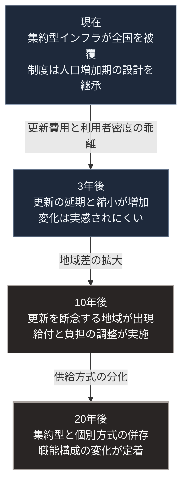

### 序論：本シナリオの前提

本章は、3つのシナリオのうち最初のものを提示します。

ベースラインとは、現行の制度と行動が概ね継続し、区分Bの不連続な事象が同時多発しない場合の経過です。最も蓋然性が高いという意味ではなく、他の2つのシナリオを比較するための基準として位置づけます。

**共通の前提**

3つのシナリオはいずれも、次の前提を共有します。これらは第Ⅲ部-1における階層1、すなわち既に確定した事象です。

人口の年齢構成は、第Ⅱ部A-2で示した推計に沿って推移します。2070年に向けて、65歳以上の割合は上昇を続けます。

インフラの物理的な劣化は、設置年次に応じて進行します。

**本シナリオに固有の前提**

第一に、第Ⅲ部-4で定義した区分Bの事象は発生しないか、発生しても単発にとどまり、余力の範囲内で吸収されます。この前提は、次章の楽観シナリオと共通です。

第二に、生成AIの普及は継続しますが、生産性の向上は労働投入量の減少を部分的にしか相殺しません。

第三に、集約型インフラが撤退する区域において、代替の供給方式は体系的には用意されません。

第四に、現行の制度は漸進的に改定されますが、抜本的な再設計は行われません。

以下の各項目には、第Ⅲ部-1の手続2に従い、記述が依拠する確度の階層を【階層n】として付します。

### 1. 3年後（2029年前後）

【階層2】 **供給基盤**：エネルギーと食料の供給構造に大きな変化は生じません。自給率は現在の水準の近傍で推移します。

【階層2】 **財政**：債務残高の累積が継続します。金利水準の変動により、利払費が歳出に占める割合が変動します。

【階層2】 **労働**：生成AIの業務利用が拡大します。職種によって導入の程度に差が生じます。第Ⅲ部-5で述べた技能習得への影響は、この時点では可視化されません。

【階層2】 **地域**：人口減少の進んだ自治体において、インフラの更新を延期または縮小する判断が増加します。

**この時点で観測されること**：変化は緩やかであり、多くの人にとって日常の実感としては現れません。

### 2. 10年後（2036年前後）

【階層2】 **供給基盤**：発電構成において再生可能エネルギーの比率が上昇します。ただし、自給率の改善は限定的です。輸入依存の構造は維持されます。

【階層4】 **財政**：社会保障給付の増加が継続します。給付水準の調整、負担率の引き上げ、あるいは支給開始年齢の変更のうち、いずれかまたは複数が実施されます。どの組み合わせが選ばれるかは、制度の選択に依存します。

【階層2】 **労働**：知的労働の一部において、業務の構成が変化します。第Ⅲ部-5で述べた技能の世代間継承に関する影響が、一部の職種で顕在化し始めます。

【階層2】 **地域**：インフラの更新を断念する地域が現れます。上下水道については、給水区域の縮小や個別方式への転換を検討する事例が増加します。

【階層2】 **情報環境**：生成された情報の量が増大します。真偽の判定に要する費用が上昇し、情報源の選択が分化します。

**この時点で観測されること**：地域間の格差が拡大します。都市部では変化が緩やかである一方、人口密度の低い地域では供給水準の低下が明確になります。

### 3. 20年後（2046年前後）

【階層2】 **供給基盤**：集約型インフラの維持範囲が縮小します。維持される区域と、個別方式へ転換した区域とが併存します。

【階層4】 **財政**：社会保障制度の設計が変更されています。給付と負担の関係が、現行とは異なる形に再定義されている可能性があります。

【階層2】 **労働**：職能の構成が現在とは異なります。定型的な知的労働の比重が低下し、判断と責任を伴う業務、および物理的な作業の比重が相対的に上昇します。

【階層2】 **地域**：居住の分布が変化します。行政サービスとインフラが維持される区域への集住が進む一方、それを選択しない層も存在します。

【階層4】 **制度**：意思決定の速度と、環境変化の速度との差が拡大します。ただし、制度の枠組み自体は維持されています。

### 🗺️ 図：ベースラインにおける変化の経路

3つの時点における主要な変化を示します。

#### 図の読み方

この図が示すのは、ベースラインにおける変化が破局ではなく縮退であるという点です。

破局とは、系全体が短期間に機能を停止する事態です。縮退とは、機能の範囲を段階的に狭めながら、中核部分を維持する過程です。

ベースラインにおいて生じるのは後者です。この過程には、次の特徴があります。

第一に、変化が緩やかであるため、当事者が認識しにくいこと。各年の変化は小さく、前年との比較では問題として認識されません。

第二に、影響が不均等に分布すること。人口密度の高い地域では変化が緩やかであり、低い地域では急速です。全国平均の統計では、この差が見えにくくなります。

第三に、後戻りが困難であること。一度撤去されたインフラの再敷設には、当初の建設費用を上回る費用がかかります。

第Ⅰ部A-6で整理した枠組みに照らすと、この経過は段階2から段階3への移行に相当します。すなわち、余力が逓減する過程です。正統性が争点化する段階4には至りません。

ただし、第Ⅲ部-4で示した区分Bの事象がこの過程のいずれかの時点で発生した場合、経過は変わります。次章以降で、その分岐を扱います。

---

### 本シナリオが外れる条件

本セクションは、本シナリオの妥当性が失われる条件を明示します。

1.  **前提が破られる場合**

    本シナリオは、区分Bの事象が単発にとどまり、余力の範囲内で吸収されることを前提としています。区分Bの事象が複数近接して発生した場合、または単発でも余力の範囲を超えた場合、本シナリオは適用されません。この場合、経過は第Ⅲ部-11の悲観シナリオに近づきます。

2.  **技術的な突破が生じる場合**

    生成AIの能力が想定を超えて向上し、労働の構成が短期間に転換する場合、本シナリオの労働に関する記述は妥当性を失います。この場合は、次章の楽観シナリオまたは第Ⅲ部-11の悲観シナリオが該当します。

3.  **制度の抜本的な再設計が行われる場合**

    本シナリオは、制度が漸進的にのみ改定されることを前提としています。供給方式の転換や社会保障の再設計が体系的に実施される場合、経過は異なります。

4.  **本シナリオの位置づけ**

    ベースラインは、予測ではありません。何も特別なことが起こらなかった場合に到達する状態です。

    この基準を設ける意義は、他のシナリオとの差分を明確化する点にあります。次章以降では、この基準からの乖離として、楽観と悲観を記述します。
