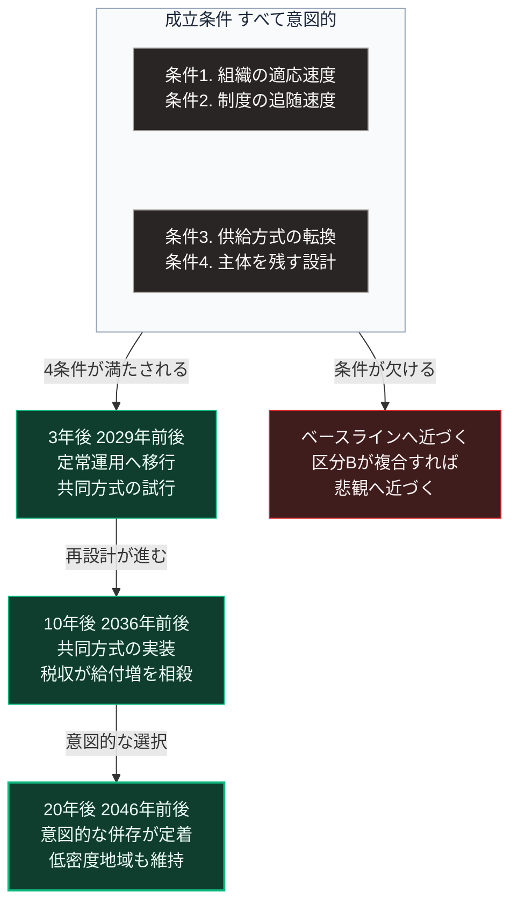

### 序論：本シナリオの前提

本章は、ベースラインからの上方への乖離を記述します。

楽観シナリオとは、すべてが順調に進む未来ではありません。人口の年齢構成は共通の前提として変わりません。本シナリオが想定するのは、その制約に対して有効な応答が行われた場合の経過です。

**本シナリオに固有の前提**

第一に、生成AIによる生産性向上が、労働投入量の減少を相殺する水準に達します。

第二に、その生産性向上の利益が、第Ⅰ部C-12で述べた局面4、すなわち再配分の段階まで比較的短期間で到達します。

第三に、区分Bの事象は発生しないか、発生しても単発にとどまり、余力の範囲内で吸収されます。この前提は、前章のベースラインと共通です。

第四に、供給方式の転換が、地域の必要に応じて実施されます。

第五に、第Ⅲ部-4で述べた経路2、すなわち判断の主体を個人に残す設計が普及します。

ベースラインとの差は、第二、第四、第五の前提にあります。区分Bの扱いは、両シナリオを分けません。以下の各項目には、第Ⅲ部-1の手続2に従い、記述が依拠する確度の階層を【階層n】として付します。

### 1. 前提が成立する条件

本シナリオの前提が成立するには、次の条件が必要です。これらは楽観的な仮定ではなく、検証可能な条件として記述します。

**条件1：生産性向上の水準**

労働投入量の減少を相殺するには、1人あたりの生産量が同率で増加する必要があります。第Ⅱ部A-2で参照した将来推計によれば、15歳から64歳の人口は2020年の7,509万人から2045年に5,832万人へ減少します [ [ 62 ] ](https://www.ipss.go.jp/pp-zenkoku/j/zenkoku2023/pp_zenkoku2023.asp) 。25年で約22%の減少であり、年率に換算すると約1.0%の減少にあたります。2070年の4,535万人まで延長しても、年率は同じく約1.0%です。

したがって、労働投入量が生産年齢人口に比例すると仮定した場合、必要な向上率は1人あたりで年あたり約1%です。労働参加率の上昇はこの必要率を引き下げ、労働時間の短縮は引き上げます。

第Ⅰ部C-1で参照したデイヴィッドの分析によれば、技術の効果は組織の再設計を経て発現します。したがってこの条件は、AIの性能ではなく、組織側の適応速度に依存します。

**条件2：利益配分の速度**

第Ⅰ部C-12で参照したアレンの分析によれば、産業革命期には生産性向上から実質賃金の上昇まで約50年を要しました。

本シナリオは、この期間が大幅に短縮されることを前提とします。短縮の条件は、制度の追随速度です。

**条件3：供給方式の転換**

人口密度が低下した地域において、集約型インフラの維持が困難になることは、ベースラインと共通です。

本シナリオが異なるのは、その地域において代替の供給方式が実装される点です。これにより、供給水準の低下ではなく方式の変更として処理されます。代替の供給方式とは、世帯単位の個別方式、または近隣単位の共同方式を指します。

**条件4：判断の主体を残す設計の普及**

第Ⅲ部-4で述べたとおり、判断を委ねる経路1は負荷が低く、選ばれやすい条件が揃っています。本シナリオは、経路2の負荷を経路1に近づける設計が普及することを前提とします。この条件が、第Ⅲ部-10で整理する差分4、すなわち事実に関する共通認識の維持を支えます。

### 2. 3年後（2029年前後）

【階層4】 **労働**：業務における生成AIの利用が、実験段階から定常運用へ移行します。組織の業務手順が、この技術を前提として再設計され始めます。

【階層4】 **地域**：小規模な地域において、個別方式または共同方式による供給が試行されます。制度上の障壁が特定され、その除去が検討されます。

【階層4】 **制度**：技術の導入を前提とした規制の見直しが進みます。

### 3. 10年後（2036年前後）

【階層2】 **労働**：職能の構成が変化します。ただし、失業の増加としてではなく、業務内容の変化として現れます。

第Ⅲ部-4で述べた技能習得への影響については、育成過程の再設計によって部分的に緩和されます。

【階層4】 **供給基盤**：個別方式および共同方式が、一定の規模で実装されます。これにより、集約型インフラの維持範囲が縮小しても、供給水準は維持されます。

【階層4】 **財政**：生産性向上による税収の増加が、社会保障給付の増加を部分的に相殺します。制度の調整は必要ですが、その幅はベースラインより小さくなります。

【階層4】 **情報環境**：第Ⅲ部-4で述べた経路2の設計が普及します。判断の根拠が提示され、情報源へ到達できる仕組みが標準となります。

### 4. 20年後（2046年前後）

【階層4】 **供給基盤**：集約型と共同方式の併存が定着します。ベースラインとの差異は、共同方式が「集約型の撤退の結果」ではなく「意図的な選択」として実装されている点です。

【階層2】 **労働**：知的労働の内容が変化しています。定型的な生成や整理は自動化され、判断、責任、そして関係の構築が中心となります。

【階層4】 **地域**：人口密度の低い地域においても、生活基盤が維持されます。維持の方式は、集約型インフラの延伸ではなく、局所的な供給と広域の相互支援の組み合わせです。

【階層4】 **制度**：意思決定の手続が、環境変化の速度に部分的に適応しています。

### 🗺️ 図：楽観シナリオを成立させる4つの条件

上段に成立条件、下段に条件が満たされた場合の3つの時点を示し、右列に条件が欠けた場合の分岐を置きます。

#### 図の読み方

上段の枠には、4つの成立条件を2つの箱にまとめて縦に並べています。枠から矢印が2本に分かれます。左下は4条件が満たされた場合の経過であり、3年後から20年後へと3つの箱が下ります。右は条件が欠けた場合の分岐です。

この図が示すのは、楽観シナリオの成立が技術の進歩に依存しないという点です。

上段の4つの条件のいずれも、技術の性能に関するものではありません。条件1は組織の適応、条件2は制度の追随、条件3は実装の実行、条件4は設計の選択です。

この構造は、第Ⅰ部C-1で整理した4段階モデルから直接導かれます。技術の効果は、効果2（組織の再設計）と効果4（制度の変更）を経て初めて発現します。効果1（作業の代替）だけでは、社会的な帰結は生じません。

したがって、本シナリオが実現するかどうかを判断する指標は、AIの能力ではありません。業務手順が実際に変更された組織の比率、制度改定の実施状況、個別方式および共同方式の実装件数、そして判断の根拠を提示する設計の実装状況です。

左列の3つの箱は、第2節から第4節で述べた各時点の状態を要約したものです。20年後の箱に記した「意図的な併存」が、ベースラインとの差異です。ベースラインでも集約型と個別方式は併存しますが、それは撤退の結果として生じます。

右の箱は、枠内の条件が欠けた場合の帰結です。4つの条件はいずれも意図的な行為を要し、自然に成立するものではありません。条件が欠ければ、経過はベースラインに近づきます。さらに区分Bの事象が複合すれば、悲観シナリオに近づきます。

---

### 本シナリオが外れる条件

1.  **条件1が満たされない場合**

    技術が導入されても、業務手順が変更されない場合、生産性の向上は限定的です。この場合、経過はベースラインに近づきます。

2.  **条件2が満たされない場合**

    生産性が向上しても、その利益の配分が特定の層に集中する場合、労働投入量の減少に対する社会全体の応答としては不十分です。

    この場合、第Ⅰ部C-12で述べた局面2、すなわち抵抗の局面へ移行しうると考えられます。

3.  **条件3が満たされない場合**

    集約型インフラの撤退に対して代替の供給方式が実装されない場合、地域に関する経過はベースラインの記述と同じになります。

4.  **条件4が満たされない場合**

    判断の主体を残す設計が普及しない場合、情報環境に関する経過はベースラインの水準にとどまります。第Ⅲ部-10で整理する差分4は、楽観の特徴を失います。

5.  **区分Bの事象が複合する場合、または単発でも余力の範囲を超える場合**

    区分Bの事象が複数近接して発生した場合、または単発でも余力の範囲を超えた場合、本シナリオは適用されません。ただし、代替の供給方式が実装済みであれば、縮退の範囲はベースラインより限定されます。この組み合わせの扱いは、第Ⅲ部-10で整理します。

6.  **本シナリオの位置づけ**

    本シナリオは、実現可能性が高いという主張ではありません。4つの条件が満たされた場合に到達する状態です。

    このシナリオを提示する意義は、条件を特定することにあります。条件が明示されていれば、その条件を満たすための行動を検討できます。
