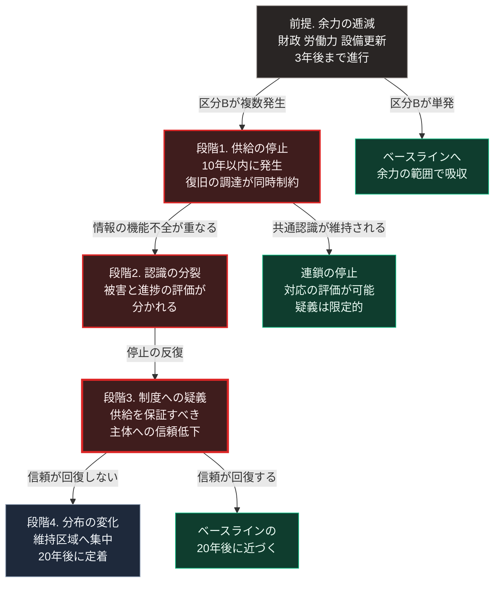

### 序論：本シナリオの前提

本章は、ベースラインからの下方への乖離を記述します。

悲観シナリオとは、社会が消滅する未来ではありません。第Ⅱ部A-1で示したとおり、日本の生活基盤は複数の層から成り、そのすべてが同時に失われる事態は想定しにくいものです。

本シナリオが記述するのは、余力が逓減した状態に複数の衝撃が近接して到来した場合、機能の縮退がどの範囲まで及び、どれだけ長期化するかです。

**本シナリオに固有の前提**

第一に、第Ⅲ部-3で定義した区分Bの事象のうち、複数が10年以内に発生します。

第二に、その時点において、区分Aによる余力の逓減が進行しています。

第三に、生産性の向上は、労働投入量の減少を相殺する水準に達しません。

第四に、第Ⅲ部-4で述べた経路1、すなわち判断の委託が支配的となります。

本章の記述は、これらの前提のもとでの推論です。前提が成立しない場合、記述は妥当性を持ちません。以下の各項目には、第Ⅲ部-1の手続2に従い、記述が依拠する確度の階層を【階層n】として付します。

### 1. 複合事象の構成

第Ⅲ部-3で示した区分Cのうち、次の組み合わせを想定します。

**組み合わせ1**：海上輸送路の制約が発生している状態で、大規模地震が発生する。

この場合、復旧に必要な燃料、資材、そして人員の調達が同時に困難になります。第Ⅱ部A-1で示したとおり、エネルギー自給率は15.3%であり、食料の供給熱量ベースの自給率は38%です。輸送路が制約された状態では、これらの補充が滞ります。

**組み合わせ2**：インフラへの攻撃と、情報環境の機能不全が同時に発生する。

供給が停止した状況において、その状況に関する情報が錯綜する状態です。復旧作業の優先順位付けと、住民の行動判断の双方に影響します。

### 2. 事象発生後の経過

本節は、複合事象の発生時点を起点とした経過です。発生時期は特定しないため、時間軸は事象からの相対で記します。

【階層3】 **発生から数日**

集約された設備が機能を停止した場合、影響は広域に及びます。第Ⅱ部A-1で示したとおり、発電は火力が68.6%を占め、その燃料は輸入に依存します。

この期間において、備蓄が機能します。ただし備蓄の設計は、想定される停止期間に依存します。

【階層3】 **数週間から数か月**

復旧の速度は、設備の代替可能性によって規定されます。大型の変圧器、発電設備の主要部品、そして通信の中核設備は、製造に長期間を要します。

第Ⅱ部B-1で参照した事例において、発電設備への攻撃が繰り返された地域では、供給の完全な回復に長期を要しました。

【階層3】 **1年以上**

供給水準の低下した状態が継続する場合、居住の分布が変化します。供給が維持される区域への移動が生じます。

この移動は、第Ⅰ部A-2で扱ったローマの事例、および第Ⅱ部で扱った現代の人口移動と、同型の現象です。

### 3. 3つの時点における状態

前節の経過を、ベースラインおよび楽観と同じ時間軸に置き直します。前提により複合事象は10年以内に発生しますが、その時期は特定しません。

**3年後（2029年前後）**

【階層2】 **供給基盤・財政・労働・地域**：複合事象が未到来であれば、この時点の状態はベースラインの3年後と同じです。余力の逓減のみが進行します。

【階層3】 **備え**：代替の供給方式は実装されておらず、備蓄は短期の停止を前提に設計されています。この状態が、後の縮退の範囲を規定します。

**10年後（2036年前後）**

【階層3】 **供給基盤**：複合事象の発生後、集約型インフラの維持範囲が縮小します。ベースラインと異なるのは、縮小が計画ではなく復旧の断念として生じる点です。復旧の完了しない区域が残ります。

【階層3】 **財政**：第Ⅲ部-3のC-3のとおり、大規模な復旧需要と財政の裁量余地の制約が同時に生じます。復旧の優先順位が、地域間の配分をめぐる争点になります。

【階層3】 **労働**：生産性の向上は労働投入量の減少を相殺しないまま、復旧作業への労働需要が加わります。技能の世代間継承に関する影響が、ベースラインより早く顕在化します。

【階層3】 **地域**：供給が維持される区域への移動が始まります。移動しない層は、縮退した供給水準のもとで生活します。

【階層3】 **情報環境**：被害と復旧の進捗に関する認識が分裂します。次節で述べる段階2の状態です。

**20年後（2046年前後）**

【階層3】 **供給基盤・地域**：居住と経済活動の分布の変化が定着します。供給が維持される区域と、そうでない区域との差が、ベースラインより大きくなります。

【階層4】 **制度**：供給を保証すべき主体への信頼が回復するかどうかが、この時点の分岐です。回復しない場合、第Ⅰ部A-8の段階4に相当する局面へ移行します。回復する場合、経過はベースラインの20年後に近づきます。

### 4. 制度への影響

第Ⅰ部A-8で整理した枠組みによれば、崩壊の段階4は、統治の正統性が争点化する局面です。

本シナリオにおいて、この局面へ移行する条件は次のとおりです。

第一に、供給の停止が繰り返されること。単発の事象は、外部要因として受容されます。

第二に、その原因が個別の判断ミスではなく、制度そのものにあるという認識が広がること。

第三に、代替の秩序を提示する主体が現れること。

第Ⅰ部A-5で扱った江戸幕府の事例において、崩壊の起点は財政ではなく、軍事的敗北でもありませんでした。条約の勅許を得られなかったことにより、統治の前提が公然と否定されたことです。

同様に、本シナリオにおいて決定的となるのは、供給停止そのものではありません。供給を保証すべき主体が、それを保証できないという認識が定着することです。

### 5. 情報環境の作用

第Ⅲ部-4で述べたとおり、生成された情報の量が増大し、真偽の判定費用が上昇した状態では、共通の事実認識が形成されにくくなります。

この状態が複合事象と重なった場合、次の帰結が生じます。

第一に、被害の実態に関する認識が分裂します。

第二に、復旧の進捗に関する評価が分かれます。

第三に、対応の是非をめぐる議論が、事実の確認を経ずに進行します。

第Ⅰ部B-4で述べたとおり、民主的な意思決定は共通の事実認識を条件とします。この条件が欠けた状態では、意思決定の正統性が調達されません。

### 🗺️ 図：悲観シナリオにおける連鎖

余力の逓減から段階4までの連鎖を左列に、各段階で連鎖を外れる分岐を右列に示します。

#### 図の読み方

左列は、上から前提、段階1から段階4へと下る連鎖です。右列の3つの箱は、各時点で連鎖を外れる分岐であり、左列から「区分Bが単発」「共通認識が維持される」「信頼が回復する」と記した矢印で結ばれています。

左列の各箱には、本文第3節の時間軸を添えています。前提の逓減は3年後まで進行し、段階1の供給停止は10年以内に発生し、段階4の分布の変化は20年後に定着します。

この図において最も重要なのは、段階2から段階3への移行です。

段階1、すなわち供給の停止それ自体は、外部要因によって生じます。この段階までは、制度の問題として認識されません。

段階3への移行を規定するのは、段階2、すなわち認識の分裂です。何が起きたのかについて共通の理解が形成されない場合、対応の妥当性を評価する基準そのものが失われます。この状態では、対応の評価が収束しにくくなります。段階1から右へ出る分岐が、この点を示しています。共通認識が維持されれば、連鎖は段階1で止まります。

したがって、悲観シナリオを回避するうえで決定的なのは、物理的な備えだけではありません。事実に関する共通の認識を維持する仕組みです。

この認識は、第Ⅴ部の設計に直結します。災害時に必要なのは、供給の維持と、状況に関する検証可能な情報の流通です。後者が欠けた場合、前者が機能していても、社会的な帰結は改善しません。

なお、段階4は破局ではありません。分布の変化として現れます。第Ⅰ部A-2で扱ったローマの事例では、供給の回復後も人口分布は元に戻りませんでした。本シナリオはこの経過を前提としますが、回復後に再流入が生じる条件は別途の検討を要します。

---

### 本シナリオが外れる条件

1.  **区分Bの事象が単発にとどまる場合**

    本シナリオは複合事象を前提とします。単発の事象であれば、余力の範囲内で吸収される可能性があります。この場合、経過はベースラインに近づきます。ただし、単発でも余力の範囲を超える場合は、本シナリオに近づきます。この組み合わせは、第Ⅲ部-10で整理します。

2.  **情報環境が機能する場合**

    段階2が生じない場合、段階3への移行は生じません。事実に関する共通認識が維持されるならば、対応の評価が可能となり、制度への疑義は限定的にとどまります。

3.  **代替の供給方式が事前に実装されている場合**

    集約型設備の停止時に、局所的な供給が機能する場合、段階1の影響が限定されます。

4.  **本シナリオの位置づけ**

    本シナリオを提示する目的は、危機感を喚起することではありません。

    目的は、どの段階で連鎖を止められるかを特定することです。前節で述べたとおり、決定的なのは段階2から段階3への移行です。この移行を防ぐ条件が特定できれば、備えの優先順位が定まります。

    第Ⅳ部および第Ⅴ部では、この優先順位に基づいて、社会と個人と技術者が取りうる行動を検討します。
