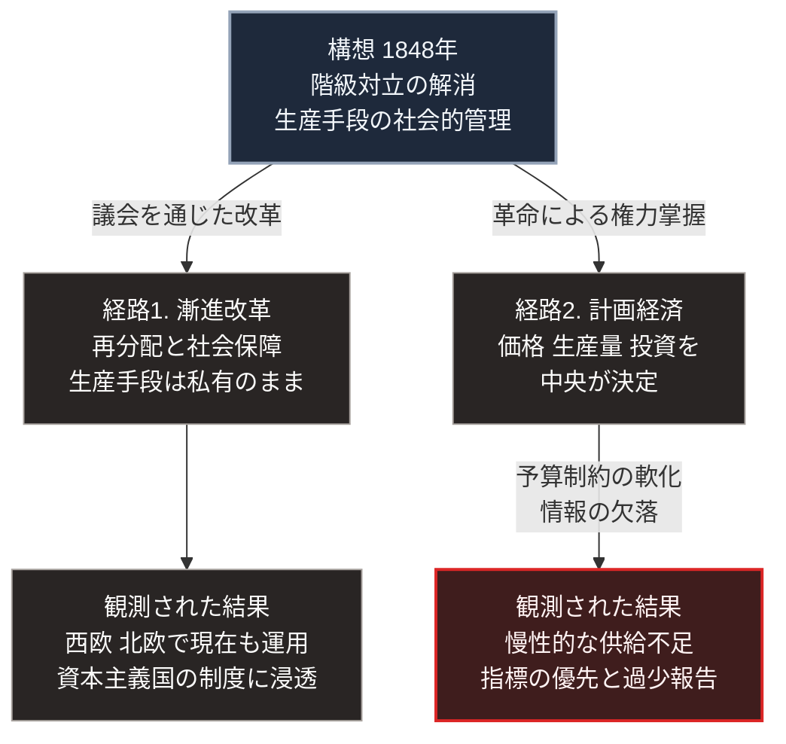

### 序論：本章が扱う範囲

本章は、生産手段の社会的な管理を掲げる統治思想を扱います。それがどのように定式化され、どのように実装され、どのような結果を残したかを記述します。

本文は事実の記述に限定します。本書は、この思想の正否を評価しません。何が構想され、何が実施され、何が観測されたかを分離して記述します。

### 1. 初期の構想（19世紀前半）

19世紀前半のヨーロッパにおいて、産業化に伴う労働条件と所得分配の問題に対し、複数の改革構想が提示されました。

アンリ・ド・サン＝シモンは、産業の管理を科学者と技術者に委ねる社会を構想しました。シャルル・フーリエは、共同生活と労働の組織化に関する具体的な設計を示しました。ロバート・オーウェンは、スコットランドのニュー・ラナークにおいて、労働時間の短縮と教育の提供を伴う工場運営を実施しています。

これらの構想に共通するのは、既存の秩序の内部で模範を示すことによって社会の変化を導こうとする方法でした。

### 2. マルクスとエンゲルスによる定式化

1848年、カール・マルクスとフリードリヒ・エンゲルスは『共産党宣言』を公表しました [ [ 90 ] ](https://www.marxists.org/archive/marx/works/1848/communist-manifesto/) 。

同文書の論旨は次のとおりです。歴史は階級間の対立として展開する。産業化は、生産手段を持つ層と、労働力を売る層への分化を進める。この分化が進行した結果として、後者による前者の打倒が生じる。

1867年の『資本論』第1巻において、マルクスはこの主張の経済学的な基礎づけを試みました [ [ 22 ] ](https://www.marxists.org/archive/marx/works/1867-c1/) 。

1875年の文書において、マルクスは移行過程についての見解を示しています [ [ 92 ] ](https://www.marxists.org/archive/marx/works/1875/gotha/) 。そこでは、生産手段の共有が実現した後にも、当初は労働に応じた分配が行われ、より後の段階で必要に応じた分配へ移行するという段階論が述べられました。

### 3. 方法をめぐる分岐（19世紀末から20世紀初頭）

19世紀末、社会主義運動の内部で方法をめぐる論争が生じました。

エドゥアルト・ベルンシュタインは1899年の著作において、資本主義の崩壊は自動的には生じておらず、労働者の生活水準は改善していると指摘しました [ [ 93 ] ](https://www.marxists.org/reference/archive/bernstein/works/1899/evsoc/) 。そのうえで、革命ではなく議会を通じた漸進的な改革を主張します。

この主張は、運動内部で「修正主義」として論争の対象となりました。以後、社会主義運動は、議会を通じた改革を目指す潮流と、革命を目指す潮流とに分岐します。

### 4. 実装 ―― ロシアにおける事例

1917年、ウラジーミル・レーニンは『国家と革命』を執筆しました [ [ 94 ] ](https://www.marxists.org/archive/lenin/works/1917/staterev/) 。同文書は、既存の国家機構を掌握するのではなく解体すべきこと、そして移行期には労働者階級による統治が必要であることを論じています。

同年10月、ボリシェヴィキが権力を掌握しました。その後の経緯は次のとおりです。

1918年から1921年にかけて、内戦下で厳格な統制経済が実施されました。1921年、生産の低下を受けて、部分的な市場取引を認める新経済政策が導入されます。1928年、第1次五カ年計画が開始され、重工業への集中投資と農業の集団化が実施されました。

この過程で、価格、生産量、投資配分の決定は、中央の計画機関に集約されます。

### 5. 拡大と多様化（20世紀中盤）

第二次世界大戦後、東欧諸国において同種の体制が成立しました。1949年には中華人民共和国が成立し、1959年にはキューバで体制転換が起こります。

一方、西欧および北欧諸国では、ベルンシュタインの流れを汲む潮流が、議会を通じた政策として実装されました。生産手段の国有化は限定的に留められ、累進課税と社会保障給付による再分配が中心となります。この形態は社会民主主義と呼ばれます [ [ 95 ] ](https://plato.stanford.edu/entries/socialism/) 。

### 6. 観測された運用結果

中央計画に基づく経済運営について、多数の実証研究が蓄積されています。

経済学者ヤーノシュ・コルナイは、これらの経済に共通して観測された現象を分析しています [ [ 96 ] ](https://openlibrary.org/works/OL887578W) 。コルナイが指摘したのは、慢性的な供給不足を偶発的な失敗ではなく体制の構造に由来するものとみなす見方です。

その機序は次のとおりです。企業の損失を国家が補填する場合、企業は投入資源の需要を抑制する動機を持ちません。この需要は際限なく拡大し、供給の追いつかない状態が恒常化します。コルナイはこれを「予算制約の軟化」と呼びました。

第Ⅰ部B-3で参照した分析においても、計画指標の達成が品質や需要適合より優先される傾向、および生産単位が自らの能力を過少に報告する動機が観測されています [ [ 84 ] ](https://www.aeaweb.org/articles?id=10.1257/jep.5.4.11) 。

### 7. 体制の転換（1989年から1991年）

1989年、東欧各国で体制の転換が相次ぎました。同年11月にはベルリンの壁が開放されます。1991年12月、ソビエト連邦は解体しました。

中国は1978年以降、市場的な要素を段階的に導入し、生産手段の公有を維持したまま価格形成と企業経営に市場機構を組み込む方式へ移行しています。

### 🗺️ 図：構想・実装・結果の分離

同一の思想が、実装段階でどの制約に直面したかを示します。

#### 図の読み方

この図は、上段の1つの構想が中段で左右2つの経路に分かれ、下段でそれぞれの結果に至る形をしています。上段が思想そのもの、中段がその実装形態、下段が実装の生んだ結果という3層です。

左の列（経路1）は、生産手段の所有構造を変えず、成果の分配を政策によって調整する方式です。右の列（経路2）は、所有構造そのものを変更し、配分の決定を中央に集約する方式です。

観測された不具合は、右の列の下段に集中しています。ここで重要なのは、その原因が指導者の資質や意図に帰されていないという点です。コルナイの分析も、第Ⅰ部B-3で参照した分析も、原因を制度の誘因構造に求めています。

右の列の矢印に添えた2語が、その誘因構造です。損失が補填される主体は資源を節約する動機を持たず、指標で評価される主体は指標を最適化します。能力を報告する主体は、次期の負担を避けるために過少に報告します。これらはいずれも、各主体にとって合理的な行動です。

第Ⅰ部B-3で扱った情報の問題と、本章で扱った誘因の問題。この2つが重なった点が、右の列の構造的な制約でした。

一方、左の列の下段が示すとおり、経路1は現在も多くの国で運用されています。この事実は、構想の内容と実装形態とを区別して評価する必要性を示しています。

---

### 現代社会構造への射程と本質（本章のまとめ）

本セクションは、著者による解釈です。前節までの記述とは区別して読んでください。

1.  **現代社会構造の原点**

    現代の先進国が備える社会保障制度、累進課税、労働時間規制、そして公教育の無償化は、その多くが19世紀の労働運動と社会主義運動が提起した課題への応答として制度化されました。たとえば1883年にドイツで成立した疾病保険法は、社会主義者を取り締まる法律の下で労働者の支持を確保する目的を伴って導入されました [ [ 267 ] ](https://www.ssa.gov/history/ottob.html) 。一方、プロイセンの義務教育のように、社会主義運動に先行する制度も存在します。

    したがって、経路2の体制が消滅したことは、この思想が現代社会に痕跡を残していないことを意味しません。むしろ、経路1の要素は、現在の資本主義国の制度に広く組み込まれています。

2.  **歴史的事実の本質**

    本章から抽出できるのは、思想の妥当性と実装の帰結とを混同してはならない、という方法論上の教訓です。

    経路2で観測された不具合は、平等という目標が誤っていたことを示すものではありません。それが示したのは、特定の実装方式が特定の誘因構造を生み、その誘因構造が意図と逆の結果を導いたという因果です。

    この区別は、本書が未来を推論するうえで重要です。ある目標が望ましいことと、その目標を達成する手段が機能することとは、独立に検証されなければなりません。

3.  **現代社会の現状と課題**

    第Ⅲ部では、生成AIによる情報処理能力の向上が、経路2の制約をどの程度解除しうるかを検討します。

    ただし、本章で示したとおり、経路2の制約は情報処理能力のみに起因するものではありませんでした。誘因構造という第二の制約が存在します。この点を無視した「技術によって計画経済が可能になる」という議論は、観測された事実の半分しか扱っていないことになります。
