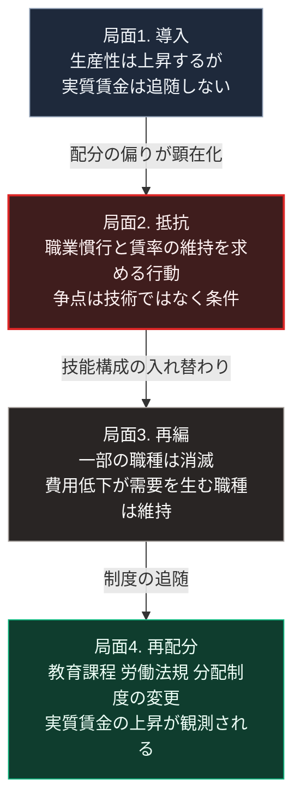

### 序論：本章が扱う範囲

本章は、技術革新によって既存の職能が価値を失う過程で、実際に何が観測されたかを記述します。

この論点は、現在進行中の変化を評価するうえで重要です。ある技術が職を奪うという主張も、長期的には雇用が維持されるという主張も、いずれも過去に繰り返されてきました。本章では、そのどちらが正しいかではなく、観測されたデータが何を示しているかを整理します。

本文は事実の記述に限定します。解釈は章末で扱います。

### 1. ラッダイト運動（1811年から1816年）

19世紀初頭のイングランド中部および北部において、繊維産業の労働者が機械を破壊する事件が連続して発生しました。この運動は、ラッダイト運動と呼ばれます。

この運動については、機械そのものへの反対として理解されることがあります。しかし労働史の研究では、より限定的な性格が指摘されています。

対象となったのは、主として熟練工の作業を代替する特定の機械でした。また、要求の内容には、賃率の維持、徒弟制度の遵守、そして粗悪品の製造停止が含まれていました。すなわち、争点は技術の存在そのものではなく、技術導入に伴う労働条件と職業慣行の変更でした。

政府は1812年に機械破壊を死刑を含む重罪とする法律を制定し、軍を動員して鎮圧しました。

### 2. 実質賃金の停滞に関する観測

産業革命期の労働者の生活水準については、長期にわたる論争がありました。

経済史家ロバート・アレンは、イギリスの長期統計を分析し、1790年代から1840年代にかけての期間について、次の観測結果を示しています [ [ 116 ] ](https://doi.org/10.1016/j.eeh.2009.04.004) 。

この期間、労働生産性は上昇していました。しかし、実質賃金はほぼ横ばいで推移しています。生産性の上昇分は、主として資本の側に配分されました。

アレンは、この期間を「エンゲルスの休止」と呼びます。実質賃金の明確な上昇が観測されるのは、1840年代以降です。

すなわち、技術革新の利益が広く配分されるまでに、およそ半世紀を要しました。

### 3. 職種の消滅に関する事例

技術の導入により、特定の職種が消滅した事例は複数存在します。

手織工は、力織機の普及によって19世紀前半に急速に減少しました。

馬車と関連する職業は、内燃機関を用いた車両の普及により20世紀前半に縮小しました。馬の飼育、馬具の製造、そして馭者という職種が対象です。

電話交換手は、自動交換機の普及により20世紀を通じて減少しました。

港湾における荷役労働は、1960年代以降のコンテナ化により大幅に縮小しました。

### 4. 職種が維持または増加した事例

一方で、自動化の導入が当該職種の減少をもたらさなかった事例も観測されています。

経済学者ジェームズ・ベッセンは、現金自動預払機（ATM）の導入と銀行窓口業務の関係を分析しました。その分析によれば、機械の導入により1支店あたりの窓口担当者数は減少しました。一方で、支店の運営費用が低下したことにより支店数は増え、窓口担当者の総数は減少していません [ [ 255 ] ](https://papers.ssrn.com/sol3/papers.cfm?abstract_id=2690435) 。

この事例が示すのは、作業単位の自動化が、必ずしも職種全体の縮小を意味しないという点です。費用の低下が需要の拡大を生む場合、総量は維持されます。

### 5. 産業用ロボットに関する定量的な分析

経済学者ダロン・アセモグルとパスカル・レストレポは、アメリカの地域別データを用いて、産業用ロボットの導入と雇用および賃金の関係を分析しました [ [ 117 ] ](https://www.nber.org/papers/w23285) 。

その分析結果によれば、労働者1,000人あたりロボットが1台増加した地域では、雇用率と賃金の双方に統計的に有意な低下が観測されました。

この研究は、影響が地域と職種によって不均等に分布することも示しています。影響が集中していたのは、製造業の集積地域と、定型的な作業に従事する層です。

### 6. 生成AIに関する初期の観測

生成AIの職務への影響については、観測データの蓄積が始まった段階にあります。

経済学者エリック・ブリニョルフソンらは、顧客対応業務における生成AIの導入効果を分析しました [ [ 118 ] ](https://www.nber.org/papers/w31161) 。

その分析によれば、導入により作業者の処理件数は平均で増加しました。同時に、増加の程度は経験年数によって異なり、経験の浅い作業者において効果が大きく、経験の長い作業者において効果が小さいという分布が観測されています。

この観測は、過去の自動化事例とは異なる分布を示唆します。従来の自動化では、定型的な作業に従事する層へ影響が集中しました。生成AIについては、初級の作業を代替することを通じて技能の習得過程そのものに影響しうるという可能性を、本書は仮説として提示します。

### 🗺️ 図：置換の4局面と、観測される指標

技術導入から職能の再編が完了するまでに、何が観測されるかを示します。

#### 図の読み方

この図は、前章の4段階モデルを、労働の側から見たものです。

局面1で観測されるのは、生産性と実質賃金の乖離です。アレンの分析が示したとおり、産業革命期にはこの乖離が約50年続きました。

局面2で発生するのは、抵抗です。ここで重要なのは、抵抗の争点が技術そのものではなく、導入の条件であったという事実です。ラッダイト運動の要求内容は、賃率と徒弟制度の維持でした。

局面3において、職種の帰趨が分かれます。分岐の条件は、費用の低下が需要の拡大を生むかどうかです。銀行窓口の事例では需要が拡大し、総量が維持されました。手織工の事例では、そうなりませんでした。

局面4で、制度が追随します。実質賃金の上昇が観測されるのは、この局面です。

本書にとって重要なのは、局面1から局面4までの所要時間です。過去の事例では、この期間は数十年に及びました。この期間、局面2で抵抗した層と、局面3で職を失った層は、局面4の恩恵を自らの職業人生の中で受け取れませんでした。

現在進行中の変化について問うべきは、この技術が最終的に雇用を増やすか減らすかではありません。局面1から局面4までの期間がどの程度になるか。そして、その期間に生じる分配の偏りが、どの層に集中するかです。

---

### 現代社会構造への射程と本質（本章のまとめ）

本セクションは、著者による解釈です。前節までの記述とは区別して読んでください。

1.  **現代社会構造の原点**

    現在の労働法規、失業給付、そして職業訓練の制度は、いずれも局面4における制度的な応答として成立しました。これらは、過去の転換において局面2と局面3で生じた事態への対処です。

    したがって、これらの制度は前回の転換に適合しています。今回の転換において同様に機能するかどうかは、別途検証が必要です。

2.  **歴史的事実の本質**

    本章から抽出できるのは、次の点です。技術革新をめぐる社会的な対立の争点は、技術の是非ではなく、移行期における配分です。

    ラッダイト運動の要求が賃率と職業慣行であったこと。現在の議論において、生成AIの能力そのものよりも、その利益が誰に帰属するかが争点となっていること。この2つは、同じ構造を持ちます。

3.  **現代社会の現状と課題**

    生成AIに関する初期の観測は、影響の分布が過去の自動化と異なる可能性を示しています。従来の自動化は定型作業に影響しましたが、今回は技能の習得過程に影響しうるという指摘です。

    もしこの指摘が妥当であれば、局面3における再編の様式が過去と異なることになります。従来は、置換された層が新しい技能を習得して別の職種へ移行する経路が想定されていました。習得過程そのものが変化する場合、この経路の前提が変わります。

    第Ⅲ部では、この論点を具体的なシナリオとして扱います。
