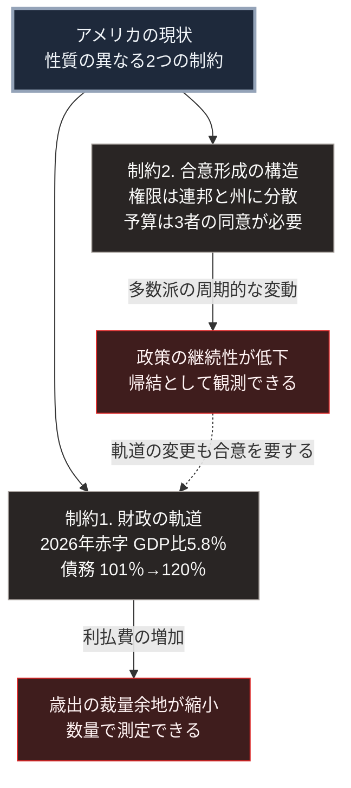

### 序論：本章が扱う範囲

本章は、アメリカ合衆国の現状を、公的機関が公表する統計と公式文書から整理します。

日本にとってアメリカの状況が重要である理由は2点あります。第一に、安全保障上の同盟関係が日本の防衛体制の前提となっているためです。第二に、基軸通貨の発行国であり、国際的な資金移動と貿易の条件を規定するためです。

本文は事実の記述に限定します。解釈は章末で扱います。

### 1. 統治機構の構成

アメリカは連邦制を採ります。連邦政府と50の州政府が、それぞれ独立した立法、行政、司法の機構を持ちます。

連邦議会は上院と下院で構成されます。上院は各州2名の計100名、下院は人口に応じて配分された435名です。大統領の任期は4年、上院議員は6年、下院議員は2年です。

この構成の帰結として、2年ごとに下院の全議席と上院の約3分の1が改選されます。したがって、大統領の所属政党と議会の多数派とが一致しない状態は、周期的に発生します。

### 2. 人口

国勢調査局の推計によれば、2024年7月1日から2025年7月1日までの人口増加率は0.5%です [ [ 134 ] ](https://www.census.gov/newsroom/press-kits/2026/national-state-population-estimates.html) 。

同局は、人口総数および変動要因の時系列データを公表しています [ [ 135 ] ](https://www.census.gov/data/tables/time-series/demo/popest/2020s-national-total.html) 。

日本や欧州と異なり、アメリカの人口は増加を続けています。ただし、増加の主要因は自然増ではなく国際移動です。この構成は、移民政策の変更が人口動態に直接反映されることを意味します。

### 3. 連邦財政

財務省が公表する日次データによれば、2026年8月25日時点の連邦政府債務残高の合計は約40兆1,000億ドルです。このうち市中保有分は約32兆3,000億ドルです [ [ 136 ] ](https://fiscaldata.treasury.gov/datasets/debt-to-the-penny/debt-to-the-penny) 。

議会予算局が2026年2月に公表した見通しでは、2026会計年度の連邦財政赤字は1兆9,000億ドル、国内総生産比5.8%と見込まれています [ [ 137 ] ](https://www.cbo.gov/publication/61882) 。

同見通しは、歳出を7兆4,000億ドル、国内総生産比23.3%、歳入を5兆6,000億ドル、同17.5%としています [ [ 137 ] ](https://www.cbo.gov/publication/61882) 。

市中保有債務の国内総生産比については、2026年の101%から2036年に120%へ上昇するとの見通しが示されています。同見通しは、この水準が1946年の106%を上回るものであると記述しています [ [ 137 ] ](https://www.cbo.gov/publication/61882) 。

### 4. 安全保障政策の枠組み

国防総省は、国防戦略を公表しています [ [ 138 ] ](https://www.defense.gov/National-Defense-Strategy/) 。同戦略は、優先すべき戦略環境と、そこに投入する能力の配分を規定する文書です。

現行の文書は、2026年1月23日に公表された2026年の国家防衛戦略です [ [ 295 ] ](https://media.defense.gov/2026/Jan/23/2003864773/-1/-1/0/2026-NATIONAL-DEFENSE-STRATEGY.PDF) 。米国の議会調査局による要約によれば、同戦略は本土防衛と西半球を優先し、インド太平洋に焦点を置き、複数の正面での戦争への備えを強調しています [ [ 296 ] ](https://www.congress.gov/crs_external_products/IF/PDF/IF10543/IF10543.14.pdf) 。

北大西洋条約機構については、2025年6月25日のハーグ首脳会議宣言において、加盟国が国防支出の目標水準に合意しました。目標は、2035年までに国内総生産の5%を国防と安全保障関連の支出に充てることです。内訳は、中核的な国防支出が3.5%以上、重要インフラの防護や強靭性の確保などの関連支出が最大1.5%です [ [ 297 ] ](https://www.nato.int/en/about-us/official-texts-and-resources/official-texts/2025/06/25/the-hague-summit-declaration) 。

### 5. 貿易政策と日本との合意

2025年7月22日、アメリカと日本は貿易と投資に関する枠組みに合意しました。ホワイトハウスの資料によれば、日本からの輸入品には原則として15%の関税が課され、日本は5,500億ドルを投資するとされています [ [ 298 ] ](https://www.whitehouse.gov/fact-sheets/2025/07/fact-sheet-president-donald-j-trump-secures-unprecedented-u-s-japan-strategic-trade-and-investment-agreement/) 。同年9月4日の大統領令は、この合意を実施し、関税率の合計が15%となるよう規定しています [ [ 299 ] ](https://www.whitehouse.gov/presidential-actions/2025/09/implementing-the-united-states-japan-agreement/) 。

日本政府の説明によれば、自動車と自動車部品への追加関税は半減され、既存の税率を含めて15%となりました。5,500億ドルについては、政府系の金融機関が出資、融資、融資保証を提供可能にするという合意です [ [ 300 ] ](https://www.kantei.go.jp/jp/103/statement/2025/0723bura2.html) 。

### 6. 意思決定における構造的な特徴

アメリカの統治機構には、権限の分散に由来する2つの特徴があります。

第一に、予算の成立には議会の両院と大統領の同意が必要です。この3者の意向が一致しない場合、暫定予算による運営、あるいは政府機関の一部閉鎖が発生します。直近では、2026会計年度の開始日である2025年10月1日から予算の失効が続きました。米国の議会調査局によれば、この失効は史上最長の42日間に及び、2025年11月12日の継続予算の成立によって終了しました [ [ 301 ] ](https://www.congress.gov/crs_external_products/R/PDF/R48765/R48765.2.pdf) 。成立した法律は公法119-37号です [ [ 302 ] ](https://www.govinfo.gov/content/pkg/PLAW-119publ37/pdf/PLAW-119publ37.pdf) 。

第二に、連邦政府の権限は憲法によって列挙されており、列挙されていない権限は州に留保されます。教育、公衆衛生、選挙管理などの領域では、州ごとに制度が異なります。

### 🗺️ 図：アメリカが直面する2つの制約

財政の軌道と、合意形成の構造を並置します。

#### 図の読み方

この図は、上段の1つの枠から左右2列へ分かれる形をしています。左列は財政の軌道、右列は合意形成の構造です。各列の2段目に、それぞれの帰結を置いています。右列の下から左列の上へ戻る点線は、2つの制約の関係を示します。

左列の制約1は、数量として測定可能です。債務残高の対国内総生産比が上昇すると、利払費が歳出に占める割合が増加します。利払費は削減の対象になりにくいため、その他の歳出項目の裁量余地が縮小します。

右列の制約2は、数量では表せません。ただし、その帰結は観測可能です。政権や議会多数派が交代するたびに、前政権の政策が撤回または変更される頻度として現れます。

点線が示すのは、左列の軌道を変更する決定もまた、右列の構造を通過するという点です。予算の成立には両院と大統領の同意が必要です。歳出の削減も歳入の増加も、この手続を経ます。したがって2つの制約は独立ではありません。

日本にとって重要なのは、右列の帰結です。同盟関係に基づく政策は、複数年にわたる継続を前提とします。相手方の政策継続性が低下する場合、その前提の確実性が低下します。

第Ⅰ部D-1で参照した枠組みに照らすと、これは「合意の履行を保証する仕組みの欠如」という条件に関わります。同盟の相手が将来も同じ方針を維持するという保証が弱まると、他の当事者は自らの能力による備えを検討することになります。

この論点は、本章の後段および国際情勢を扱う章で再度検討します。

---

### 現代社会構造への射程と本質（本章のまとめ）

本セクションは、著者による解釈です。前節までの記述とは区別して読んでください。

1.  **現在の構造がどこから来たか**

    アメリカの権限分散は、第Ⅰ部B-6で扱った共和制の設計原理に直接由来します。権力を分割し、相互に抑制させる構造です。

    この設計は、権力集中を防ぐという目的については機能しています。同時に、その代償として決定の速度が低下することも、設計時から想定されていました。

2.  **数値が示していること**

    財政の数値が示すのは、現在の水準ではなく軌道です。101%から120%へという10年間の見通しは、現行制度を前提とした場合の帰結です。

    この軌道が変更されるには、歳出の削減か歳入の増加が必要です。いずれも制約2、すなわち合意形成の構造を通過しなければなりません。したがって2つの制約は独立ではありません。制約2が、制約1の解消を困難にしています。

3.  **日本にとっての含意**

    日本の防衛体制、エネルギーの海上輸送、そして通貨の安定は、いずれも現行の国際秩序を前提としています。その秩序の維持費用の相当部分を、アメリカが負担してきました。

    財政の軌道が制約となる場合、この負担配分の見直しが議題となる可能性があります。第Ⅲ部では、この見直しが生じた場合の影響を、シナリオの一要素として扱います。
