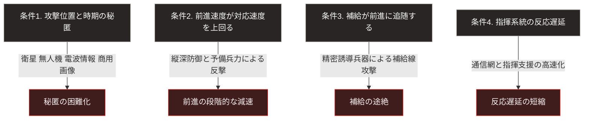

### 序論：本章が扱う範囲

本文は事実および既存研究の記述に限定し、本書の解釈は章末に分離します。

本章は、機動による短期決戦という戦争様式が、どのような条件下で成功し、どのような条件下で成功しなくなったかを記述します。

この論点は、第Ⅱ部で扱う進行中の武力紛争の分析、および第Ⅲ部における戦争発生リスクの評価に直結します。短期決着が可能かどうかの見積もりは、開戦の判断そのものに影響するためです。

### 1. 概念の成立に関する経緯

短期間の機動によって決着をつける戦争様式は、一般に「電撃戦」と呼ばれます。

軍事史家カール＝ハインツ・フリーザーは、この語がドイツ軍の公式な作戦教義として体系化されていたわけではないと論じています [ [ 111 ] ](https://openlibrary.org/works/OL18779302W) 。

その研究によれば、1940年の西方作戦は、事前に確立された理論の適用ではなく、現場の判断と偶発的な要素が重なった結果として成立しました。理論が先にあり作戦が実行されたのではなく、成功した作戦が事後的に理論として整理された、という順序です。

### 2. 1940年の事例における実際の条件

フリーザーの分析によれば、1940年5月の作戦において、ドイツ軍は総兵力と戦車の数量で連合国側を上回っていませんでした。

その分析が成功要因として挙げるのは、次の点です。

第一に、進攻経路の選択です。通行が困難とされた地形を主攻に選んだことにより、防御側の兵力配置と想定が一致しませんでした。

第二に、機甲部隊の集中運用です。戦車を歩兵支援に分散させず、集中して突破に用いる編成が採られました。

第三に、指揮の分権です。上級司令部が詳細を指示するのではなく、現場の指揮官が状況に応じて判断する方式が用いられました。これにより、決定から実行までの時間が短縮されます。

第四に、防御側の指揮系統における反応の遅延です。突破の報告が指揮系統を遡上し、対応が決定され、それが部隊へ伝達されるまでの間に、突破部隊はさらに前進していました。

### 3. 成功条件の抽出

前節の分析から、この様式が成立する条件を整理すると次のようになります。

条件1：攻撃の位置と時期が防御側に予測されていないこと。

条件2：突破後の前進速度が、防御側の対応速度を上回ること。

条件3：突破部隊への補給が、前進速度に追随できること。

条件4：防御側の指揮系統が、局所的な崩壊を全体の判断へ反映するまでに時間を要すること。

### 4. 条件の失効 ―― 縦深防御という応答

1943年以降、防御側は縦深に配置された陣地帯を構築する方式を採用しました。

この方式は、突破そのものを阻止するのではなく、突破後の前進を段階的に減速させることを目的とします。突破部隊が前進するにつれ、側面が伸長し、補給線が長くなります。この状態で予備兵力による反撃を受けると、突破部隊は包囲される可能性に直面します。

この応答は、前節の条件2と条件3を無効化します。

### 5. 条件の失効 ―― 監視能力の向上

条件1、すなわち攻撃の位置と時期を秘匿することは、監視技術の進展によって困難になりました。

偵察衛星、無人航空機、電波情報の収集、そして商用衛星画像の普及により、大規模な部隊の集結を秘匿することは、現在では極めて困難です。

さらに、集結地点が特定された場合、精密誘導兵器によって集結中の部隊を攻撃することが可能になります。これは、条件1の失効が条件2にも波及することを意味します。

### 6. 条件の失効 ―― 対抗手段の低廉化

1973年10月の中東における戦争において、携行型の対戦車誘導弾が装甲部隊に対して有効に機能した事例が観測されました。

以後、対戦車兵器および携行型の対空兵器は、性能の向上と価格の低下を続けています。この結果、装甲部隊の前進に対し、少人数の分散した部隊による抵抗が成立しうる状況となりました。

この変化は、第Ⅰ部D-2で述べた費用構造の観点から重要です。高価な装備を、はるかに安価な手段で無力化しうる場合、攻撃側の費用対効果は悪化します。

### 7. 条件が維持された事例

一方で、この様式が機能した事例も存在します。

1991年の湾岸における戦争では、多国籍軍が航空優勢を確立したうえで地上作戦を実施し、短期間で目標を達成しました。この事例では、条件1から条件4のすべてが攻撃側に有利な形で成立しています。

すなわち、この様式が失効したのではなく、その成立条件が満たされにくくなった、というのが正確な記述です。

### 🗺️ 図：4条件と、それを無効化する応答

各条件に対して、どの技術または方式が対抗手段となったかを示します。

#### 図の読み方

この図が示しているのは、短期決戦の成立が4条件の同時成立に依存するという構造です。

重要なのは、これらが積の関係にあるという点です。1つの条件が失われれば、他の3つが成立していても全体は成立しません。突破の位置が事前に把握されていれば、前進速度がいかに速くても、待ち構えた防御へ突入する結果となります。

現在、条件1から条件3については、対抗手段が広く普及しています。とりわけ条件1の失効は、他の条件へ連鎖的に波及します。条件4については、通信網と指揮支援の高速化によって防御側の反応遅延が短縮され、攻撃側の前進速度に対する相対的な優位が縮小しています。

この構造が意味するのは、次の点です。短期決戦を前提とした開戦の判断は、現在の技術環境において成立しにくくなっています。しかし、それは戦争が起こりにくくなったことを意味しません。短期決着の見込みが外れた場合、紛争は長期の消耗戦へ移行します。

第Ⅰ部D-1で参照した枠組みに照らせば、これは開戦前の見積もりの誤りに該当します。すなわち、私的情報と誇張の動機によって、双方が自らの優位を過大に評価した結果です。

第Ⅱ部では、この枠組みを用いて進行中の紛争を分析します。

---

### 現代社会構造への射程と本質（本章のまとめ）

本セクションは、著者による解釈です。前節までの記述とは区別して読んでください。

1.  **現代社会構造の原点**

    日本の防衛政策および国民保護の想定は、長らく短期間の事態を前提としてきたと本書は評価します。備蓄の期間、避難計画の期間、そしてインフラの復旧想定は、いずれもこの前提のもとで設計されていると考えられます。

    本章が示すのは、この前提の技術的な基礎が変化しているという点です。

2.  **歴史的事実の本質**

    本章から抽出できるのは、次の一般則です。ある戦争様式の有効性は、その様式が優れているかどうかではなく、その成立条件が満たされるかどうかによって決まります。そして条件は、対抗手段の普及によって時間とともに失われます。

    もう1つの本質は、短期決着の困難化が紛争の減少を意味しないという点です。むしろ、開戦時の見積もりと実際の経過とが乖離する確率は高まります。この乖離は、紛争の長期化として現れます。

3.  **現代社会の現状と課題**

    紛争が長期化する場合、社会が受ける影響の性質が変わります。前線の戦闘結果よりも、後方の持続能力が帰趨を左右するためです。

    この持続能力には、エネルギー供給、食糧供給、医療、そして通信の維持が含まれます。第Ⅱ部および第Ⅲ部では、日本におけるこれらの持続能力を、公的資料に基づいて評価します。
