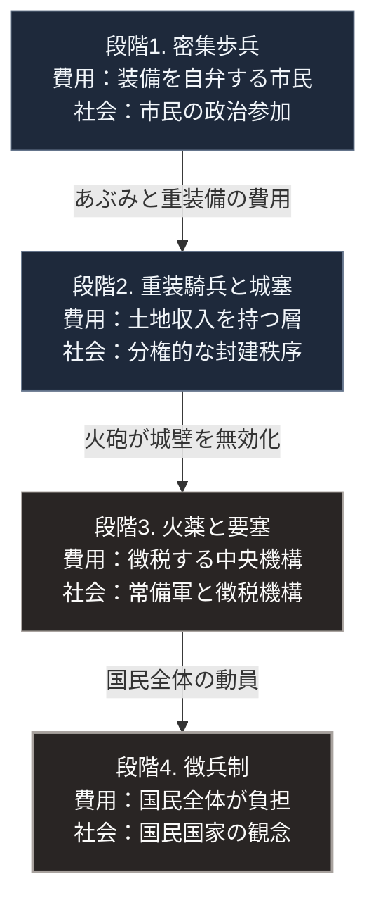

### 序論：本章が扱う範囲

本章は、戦争の技術的な様式が、どのように変化し、それが社会構造にどのような変化をもたらしたかを時系列で記述します。対象期間は、古代から19世紀までです。

本文は事実の記述に限定します。解釈は章末で扱います。

### 1. 密集歩兵の時代

古代ギリシアにおいて主流となった戦闘形態は、重装歩兵による密集隊形です。この形態では、盾を並べて防御線を形成し、槍を突き出して前進します。

この隊形が機能するには、隣接する兵士が持ち場を維持する必要があります。1名が離脱すれば防御線に穴が生じるためです。この構造は、参加者に相互の依存関係を課します。

装備は各自が自弁するため、参加できるのは一定の資産を持つ層に限られました。この参加条件と、都市国家における政治参加の資格とは、部分的に重なっていました。

ローマにおいては、より柔軟な部隊編成が採用され、長期の訓練を受けた職業的な兵士が中核を担うようになります。

### 2. 騎兵の優位と封建的な秩序

中世ヨーロッパにおいては、重装備の騎兵が戦場における主要な打撃力となりました。

技術史家リン・ホワイトは、あぶみの普及がこの変化に寄与したと論じています [ [ 100 ] ](https://openlibrary.org/works/OL6689161W) 。あぶみによって騎乗者は鞍上で安定し、槍による衝撃を馬体の運動量とともに伝達できるようになります。

この主張については、その後の研究において異論も提示されており、単一の技術で説明することへの慎重論があります。ただし、重装騎兵の維持に多大な費用を要したという点については、広く合意があります。

馬、武具、従者、そして訓練の時間。これらの費用を負担できる層は限定されます。この費用を土地の保有によって賄う仕組みが、封建的な主従関係の一側面を構成しました。

### 3. 城塞による防御の優位

同時期、防御施設の発達により、攻撃側は不利な立場に置かれました。石造の城塞を攻略するには、長期の包囲か、多大な損害を伴う強襲が必要となります。

この非対称性は、政治的な帰結をもたらしました。城塞を保有する領主は、上位者に対して一定の自律性を維持できます。中央の権力が地方を完全に統制することは、技術的に困難でした。

### 4. 火薬の導入と防御優位の終焉

火薬は中国において発明され、軍事利用は10世紀以降に確認されます。ユーラシアを経由してヨーロッパに伝播し、14世紀には火砲の使用が記録されるようになりました。

火砲の威力向上により、垂直な高い城壁は脆弱になります。1453年、オスマン帝国によるコンスタンティノープルの攻略は、大型火砲が用いられた事例として知られています。

この変化に対する応答として、15世紀末から低く厚い稜堡を備えた要塞形式が発達しました。この形式は、火砲の射撃に耐え、かつ側面からの防御射撃を可能にする幾何学的な設計を持ちます。

歴史家ジェフリー・パーカーは、この要塞形式の登場が軍事と財政に連鎖的な変化をもたらしたと論じています [ [ 101 ] ](https://openlibrary.org/works/OL1826139W) 。

その論旨は次のとおりです。新形式の要塞は建設費が高額であり、その攻略にはさらに大規模な軍隊と長期の包囲が必要となります。軍隊の規模と作戦期間の増大は、常備軍の維持と、それを支える徴税機構の整備を要求します。

### 5. 常備軍と財政機構の成立

16世紀から18世紀にかけて、ヨーロッパ諸国では常備軍の規模が拡大しました。

歴史家ウィリアム・マクニールは、軍事技術、経済組織、そして国家機構の相互作用を分析しています [ [ 102 ] ](https://openlibrary.org/works/OL469160W) 。

軍隊の維持には恒常的な財源が必要です。この必要が、徴税制度の整備、国債市場の発達、そして官僚機構の拡大を促しました。[第Ⅰ部B-4](democracy-history)で述べた議会の成立が課税同意に起源を持つという事実も、この文脈に位置づけられます。

### 6. 国民の動員 ―― 徴兵制の成立

1793年、フランス革命政府は全国民を対象とする動員を布告しました。これにより、兵員の供給源は、報酬によって募集される層から、国民全体へ拡大します。

この変化は、軍隊の規模を飛躍的に増大させました。ナポレオン戦争期の会戦では、参加兵力が数十万に達する事例が生じます。

同時に、動員の正統性が問題となります。国民へ兵役を課すには、その国家が国民のものであるという観念が必要です。徴兵制と国民国家の観念は、相互に補強し合う関係を形成しました。

### 7. 産業技術の適用

19世紀には、産業革命の成果が軍事に適用されます。

鉄道は、兵員と物資の輸送速度を変えました。電信は、離れた部隊への指令伝達を可能にします。後装式の小銃は発射速度を高め、施条砲は射程と精度を向上させました。

これらの技術が結合した結果、防御側の火力が攻撃側の突撃を圧倒する状況が生じます。この傾向は、19世紀後半の複数の戦争において観測され、20世紀初頭に決定的な形で現れました。

### 🗺️ 図：技術変化と社会構造の連動

各段階で、軍事技術の変化が社会構造の何を変えたかを示します。

#### 図の読み方

この図は上から下へ時系列として読みます。各箱の1行目が軍事技術、2行目がその技術を賄える者、3行目がそれに対応する社会構造です。矢印に添えた語が、次の段階へ移る技術的な契機です。

各箱の2行目に注目してください。変化の直接の対象は「誰が有効な戦闘力を提供できるか」です。密集歩兵の段階では、自弁できる資産層でした。騎兵の段階では、土地収入で装備を維持できる層です。火薬の段階では、徴税によって常備軍を賄える中央機構でした。徴兵制の段階では、国民全体です。

この2行目の変化が、3行目の政治的な発言権の分布と連動しています。密集歩兵の参加層と都市国家の市民権が重なったこと。騎士層が封建的な特権を持ったこと。徴兵制の導入と参政権の拡大が同じ時期に進行したこと。これらはいずれも、この連動の現れです。

3段目で生じた変化は、とりわけ重要です。ここで防御の優位が崩れたことにより、地方の自律性を支えていた技術的な基盤が失われました。中央が大規模な火砲と常備軍を保有できる一方、地方はそれに対抗できません。この非対称性が、中央集権化を技術的に可能にしました。

[第Ⅰ部A-6](meiji-centralization)で記述した明治期の中央集権化も、この文脈に位置します。武力の集約が可能であったのは、火器を装備した常備軍が、旧来の武士層を圧倒しえたためです。

---

### 現代社会構造への射程と本質（本章のまとめ）

本セクションは、著者による解釈です。前節までの記述とは区別して読んでください。

1.  **現代社会構造の原点**

    現代の国家が武力を独占している状態は、自然な帰結ではありません。火薬と常備軍という特定の技術条件のもとで成立した、歴史的な配置です。

    この配置の前提は、有効な戦闘力の保有に大規模な資本と組織を要するという点にあります。この前提が変化すれば、武力の分布も変化します。

2.  **歴史的事実の本質**

    本章から抽出できるのは、次の一般則です。軍事技術の変化は、戦術ではなく費用構造を通じて社会に作用します。そして費用構造の変化は、政治的な発言権の分布を変えます。

    したがって、新しい軍事技術が社会に何をもたらすかを評価する際に見るべきは、その技術の破壊力ではありません。その技術を保有し運用するために、どれだけの資本と組織が必要かという費用の側です。

3.  **現代社会の現状と課題**

    この観点は、[第Ⅱ部](japan-current-state)で扱う現代の紛争分析に直結します。安価な無人機が高価な装備を無力化しうる状況は、費用構造の非対称という点で、火砲が城壁を無効化した局面と比較可能です。

    [第Ⅲ部](future-method)では、この費用構造の変化が何をもたらすかを検討します。対象は、武力の分布と、それに連動する政治的な発言権の分布です。
