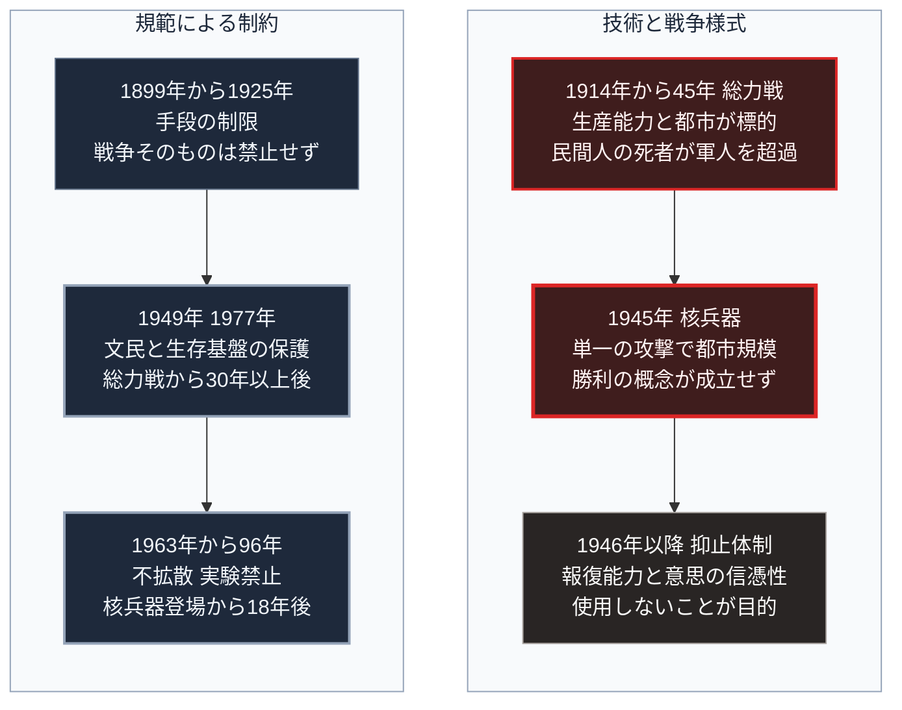

### 序論：本章が扱う範囲

本章は、20世紀における戦争の様式が、国民全体の動員を伴う総力戦から、核兵器の存在を前提とする抑止体制へ移行した経緯を記述します。あわせて、その過程で成立した国際法上の制約を整理します。

本文は事実の記述に限定します。解釈は章末で扱います。

### 1. 総力戦の成立 ―― 第一次世界大戦

1914年に始まった戦争は、当初短期間で終結すると想定されていました。実際には、西部戦線において塹壕を挟んだ膠着状態が約4年間継続します。

膠着の技術的な要因は、防御側の火力優位でした。機関銃と速射砲は、突撃する歩兵に対して大きな損害を与えます。この非対称性を突破する手段が確立されないまま、双方は損耗の累積によって相手を消耗させる方式を採りました。

この方式は、前線の兵員だけでなく、後方の生産能力を戦力の一部とします。弾薬、火砲、車両、そして食糧の供給量が、前線の持続力を規定するためです。

結果として、次の変化が生じました。第一に、産業の全体が軍需へ転換されます。第二に、労働力の不足を補うため、従来は動員されなかった層が生産に参加します。第三に、相手国の生産能力そのものが攻撃の対象となります。

### 2. 制約の試み ―― 20世紀初頭の国際法

戦争の様式に対する法的な制約は、19世紀後半から整備が進んでいました。

1899年および1907年のハーグ会議において、陸戦の法規と慣例に関する規則が採択されます。これらは、害敵手段の制限、捕虜の待遇、そして無防備都市への攻撃の禁止などを規定しました。

1925年には、窒息性ガスおよび細菌学的手段の使用を禁止する議定書が採択されます。

これらの規定は、戦争そのものを禁止するものではなく、その手段を制限するものでした。

### 3. 総力戦の徹底 ―― 第二次世界大戦

1939年に始まった戦争では、動員の規模と生産の転換がさらに徹底されました。

この戦争においては、航空機による長距離攻撃が本格的に用いられます。攻撃の対象には、軍需工場、輸送網、そして都市が含まれました。

戦闘員と非戦闘員の区別は、実行上ほぼ維持されませんでした。この戦争における死者数の推計には幅がありますが、民間人の死者が軍人の死者を上回ったとする推計が一般的です。

### 4. 核兵器の登場

1945年7月、アメリカは核分裂を利用した爆発装置の実験に成功しました。同年8月6日に広島へ、8月9日に長崎へ、それぞれ核兵器が投下されます。

この兵器が既存の兵器と異なるのは、単一の投下によって都市規模の破壊を達成する点でした。従来、同規模の破壊には数百機による反復的な攻撃を要していました。

1949年にはソビエト連邦が核実験を実施し、以後、複数の国が核兵器を保有します。

### 5. 抑止という概念の形成

核兵器の登場は、軍事戦略の前提を変更しました。

軍事理論家バーナード・ブロディは1946年の論考において、この兵器の役割を次のように定式化しています [ [ 103 ] ](https://openlibrary.org/works/OL89433W) 。従来、軍隊の主要な目的は戦争に勝つことであった。今後、その主要な目的は戦争を回避することになる、という主張です。

経済学者トマス・シェリングは、武力の役割を、実際に行使することではなく、行使する意思を相手に伝達することとして分析しました [ [ 104 ] ](https://openlibrary.org/works/OL2259854W) 。

この枠組みにおける抑止の成立条件は2点です。報復する能力と、報復する意思の信憑性です。とりわけ重要とされたのは、先制攻撃を受けた後にも報復能力が残存する状態です。

### 6. 条約による制約の体系

1960年代以降、核兵器に関する制約が条約として整備されます。

1963年、大気圏内、宇宙空間、および水中における核実験を禁止する条約が締結されました。

1968年に署名が開始された核兵器不拡散条約は、核兵器保有国の拡大を制限するとともに、保有国に軍縮交渉の義務を課しています [ [ 105 ] ](https://www.un.org/disarmament/wmd/nuclear/npt/) 。同条約は1970年に発効しました。

1996年には、あらゆる環境における核爆発実験を禁止する条約が採択されます [ [ 106 ] ](https://www.ctbto.org/our-mission/the-treaty) 。同条約は、発効要件を満たしていません。

### 7. 民間対象への攻撃に関する規範

1949年、4つのジュネーヴ条約が採択され、戦時における文民および傷病者の保護が規定されました [ [ 107 ] ](https://www.icrc.org/en/document/geneva-conventions-1949-additional-protocols) 。

1977年の追加議定書は、文民および民用物の保護をさらに詳細に規定しています。

同議定書第52条は、攻撃の対象を軍事目標に限定すべきことを定めます [ [ 108 ] ](https://ihl-databases.icrc.org/en/ihl-treaties/api-1977/article-52) 。

第54条は、文民の生存に不可欠な物、たとえば食糧、農地、飲料水の施設などへの攻撃を禁じています [ [ 109 ] ](https://ihl-databases.icrc.org/en/ihl-treaties/api-1977/article-54) 。

第56条は、危険な力を内蔵する施設を対象とします。具体的にはダム、堤防、原子力発電所です。攻撃によって危険な力が放出され文民に重大な損失をもたらす場合、これらを攻撃の対象としてはならないと規定しています [ [ 110 ] ](https://ihl-databases.icrc.org/en/ihl-treaties/api-1977/article-56) 。

これらの規定は、20世紀前半の総力戦において生じた事態への応答として整備されました。

### 🗺️ 図：破壊力の増大と、制約の追随

技術の変化と、それに対する規範の整備との関係を示します。

#### 図の読み方

この図は、左右2つの枠をそれぞれ上から下へ時系列として読みます。左の枠が技術と戦争様式の変化、右の枠がそれを制約する規範の整備です。右の枠の各箱の3行目には、対応する左の事象からの遅れを記しました。

この図が示すのは、規範が技術に先行せず、常に事後的に整備されるという構造です。左の枠の1段目で生じた事態、すなわち民間人と生産設備が攻撃対象となったことに対し、規範が整備されたのは右の枠の2段目、1949年および1977年でした。総力戦の経験から30年以上を要しています。

左の枠の2段目で重要なのは、破壊力の増大が政治目的との関係を変えた点です。第Ⅰ部D-1で参照したクラウゼヴィッツの定式によれば、戦争の規模は政治目的の大きさに規定されます。しかし核兵器の破壊規模は、通常の政治目的が要求する規模を超過します。目的を達成するために用いる手段が、目的そのものを無意味にするという構造です。

この構造が、左の枠の3段目の抑止体制を導きました。抑止とは、能力を保有しながら行使しない状態を安定的に維持する設計です。右の枠の3段目の条約は、この体制を成文化したものです。

右の枠の2段目のうち、追加議定書の第54条と第56条は本書の議論において重要です。これらは、食糧、飲料水の施設、ダム、そして原子力発電所を保護対象と規定しています。すなわち、生活基盤への攻撃が実際に発生しうるという想定のもとで整備された規定です。

第Ⅱ部で扱う進行中の武力紛争においては、発電所と送電網が攻撃対象として選択されています。これらは、第56条の保護対象である原子力発電所には該当せず、第52条のもとで軍事目標となりうる余地が残された施設です [ [ 108 ] ](https://ihl-databases.icrc.org/en/ihl-treaties/api-1977/article-52) 。規範の保護範囲の外側にある施設が選択されているという事実が何を意味するかを、そこで検討します。

---

### 現代社会構造への射程と本質（本章のまとめ）

本セクションは、著者による解釈です。前節までの記述とは区別して読んでください。

1.  **現代社会構造の原点**

    現代の日本が、生活基盤の防護をほとんど想定してこなかった背景には、この条約体系の存在があります。飲料水の施設（第54条）、ダム、堤防、原子力発電所（第56条）が保護対象として明文化されていた一方、通常の発電所や送電網は同議定書上、軍事目標となりうる余地が残されていました。

    この前提のもとで、インフラは効率を基準に設計されます。集約による費用削減が優先され、冗長性は費用として削減の対象になります。

2.  **歴史的事実の本質**

    本章から抽出できるのは、規範が技術に対して常に遅れるという点です。新しい破壊手段の出現から、それを制約する規範の成立までには、実際に被害の生じる期間が挟まれます。

    もう1つの本質は、規範の実効性が当事者の遵守意思に依存するという点です。条約は、違反を物理的に阻止する仕組みを持ちません。

3.  **現代社会の現状と課題**

    第Ⅱ部では、この2点が現在どのように現れているかを扱います。

    無人機とサイバー手段については、技術が先行し、規範が未成熟な状態にあります。生活基盤への攻撃については、規範は存在しますが、遵守されない事例が観測されています。

    この状況が意味するのは、規範の存在を前提としたインフラ設計が、その前提を再検討する必要に直面しているということです。第Ⅲ部および第Ⅴ部で、この論点を具体的に扱います。
