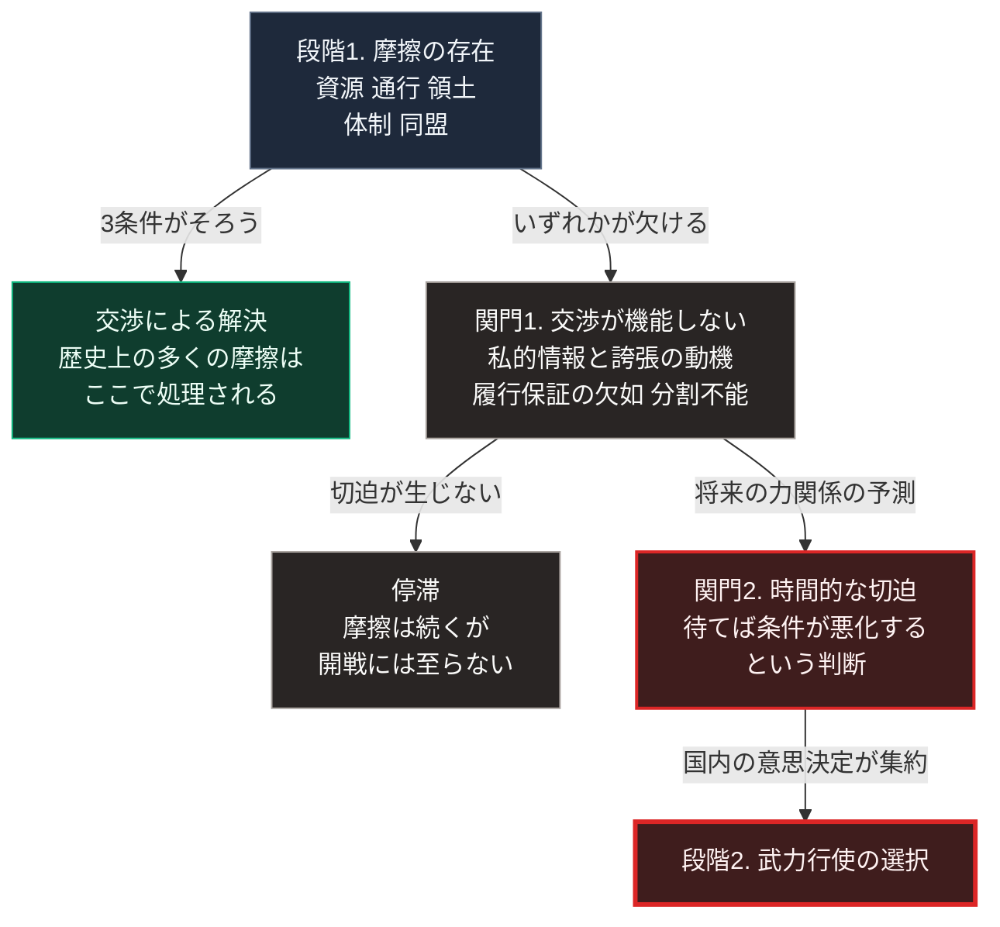

### 序論：本章が扱う範囲

本文は事実および既存研究の記述に限定し、本書の解釈は章末に分離します。

本章は、武力行使という選択がどのような条件下で採られてきたかを、政治学および歴史学の研究に基づいて整理します。

本章の目的は、戦争の是非を論じることではありません。国家間の摩擦がどの種類に達したとき武力行使へ移行したのか、その条件を特定することです。この条件が特定できれば、[第Ⅲ部](future-method)において、現在の摩擦がどの段階にあるかを評価できます。

### 1. 古典的な記述 ―― 恐怖・名誉・利益

歴史家トゥキュディデスは、ペロポネソス戦争の記録において、各都市国家が開戦を選択した動機を記述しました [ [ 86 ] ](https://www.gutenberg.org/ebooks/7142) 。

彼の記述に繰り返し現れるのは、3つの動機です。恐怖、名誉、そして利益です。

とりわけ彼が重視したのは、恐怖、すなわち将来の脅威の認識に基づく動機でした。ある勢力の伸長が、他の勢力にとって将来の脅威と認識される場合、その脅威が実現する前に対処しようとする圧力が生じます。この構造は、双方が防衛的な意図を持つ場合でも武力衝突を導きうるという点で、現代の研究においても参照されています。

### 2. 政治的手段としての戦争 ―― クラウゼヴィッツ

軍事理論家カール・フォン・クラウゼヴィッツは、戦争を独立した現象ではなく、政治的な目的を達成するための手段として位置づけました [ [ 98 ] ](https://www.gutenberg.org/ebooks/1946) 。

彼の定式化によれば、戦争は相手に自らの意思を強要するための実力行使です。したがって、戦争の様式と規模は、達成しようとする政治的目的の大きさによって規定されます。

クラウゼヴィッツはまた、計画と実行の乖離を強調しました。彼が「摩擦」と呼んだのは、地形、天候、情報の不足、そして疲労といった要因により、計画が想定どおりに実行されない性質を指します。

### 3. 合理的選択としての開戦条件

政治学者ジェームズ・フィアロンは1995年の論文において、次の問いを立てました [ [ 99 ] ](https://doi.org/10.1017/s0020818300033324) 。

戦争は双方に費用を課します。であれば、戦争を経て到達する結果を、あらかじめ交渉によって合意すれば、双方は費用を節約できるはずです。それにもかかわらず戦争が発生するのはなぜか、という問いです。

彼が提示した回答は、3つの条件に整理されます。

第一の条件は、私的情報と、それを偽る動機の存在です。各国は自国の軍事力と戦意について、相手より正確な情報を持ちます。同時に、交渉を有利にするため、その情報を誇張する動機を持ちます。この結果、双方の見積もりが一致せず、交渉による解決点が特定できません。

第二の条件は、合意の履行を保証する仕組みの欠如です。交渉で合意しても、相手が将来それを守る保証がありません。とりわけ、相手の力が将来増大すると予想される場合、現時点の合意は将来破棄されると見込まれます。この予想が、力の差が小さいうちに行動する動機を生みます。

第三の条件は、争点が分割できない場合です。領土の主権や政権の帰属など、部分的な妥協が成立しない争点においては、交渉の余地が構造的に存在しません。

### 4. 摩擦の類型

以下は、前節の枠組みと歴史的な事例に基づく本書の作業上の類型です。特定の研究に帰属する分類ではありません。

**資源をめぐる摩擦**：エネルギー、水、鉱物、そして漁業資源の配分に関する対立です。この類型は、原則として分割可能であり、交渉による解決の余地があります。

**通行と接続をめぐる摩擦**：海峡、運河、航路、そして通信路の管理に関する対立です。物理的な要衝が限定されているため、代替の確保が困難な場合に緊張が高まります。

**領土と主権をめぐる摩擦**：国境線および特定領域の帰属に関する対立です。フィアロンの第三の条件に該当し、分割が困難です。

**体制の正統性をめぐる摩擦**：一方の体制の存在が、他方の体制にとって内政上の脅威と認識される場合の対立です。

**同盟関係の変更をめぐる摩擦**：ある国が所属する陣営を変更しようとする局面で生じる対立です。この類型は、力の分布を将来にわたって変化させるため、フィアロンの第二の条件を活性化させます。

### 🗺️ 図：摩擦から開戦への移行条件

摩擦が存在するだけでは開戦に至りません。その間に何が必要かを示します。

#### 図の読み方

この図は、最上段の摩擦から最下段の開戦まで、右の列を下る経路と、途中で左へ抜ける2つの出口からなります。摩擦の存在と開戦とが直結しないという点を示します。右の列を下るには、2つの関門を両方とも通過しなければなりません。

最初の出口は、最上段の左です。摩擦があっても、次の3条件がそろえば交渉で解決されます。双方が相手の実力を正確に把握していること。合意の履行が保証されること。争点が分割可能であることです。実際、歴史上の多くの摩擦は交渉で処理されてきました。

右の列の関門1は、この3条件のいずれかが欠けた状態です。箱の2行目と3行目が、第3節で整理したフィアロンの3条件に対応します。

関門1を通過しても、2つ目の出口があります。将来の力関係に関する予測が切迫を生まなければ、摩擦は膠着したまま続き、開戦には至りません。

右の列の関門2が、本書の推論において決定的です。ここで作用するのは、現在の力関係ではなく、将来の力関係に関する予測です。「今は互角だが、5年後には相手が優位になる」という予測が成立したとき、その5年を待つ選択は不利になります。

この構造は、予測そのものが行動を引き起こすという性質を持ちます。相手が将来強くなるという予測が、予測される側の行動とは無関係に、予測する側の先制を動機づけます。

したがって、開戦リスクを評価する際に観測すべきは、現在の軍事バランスではありません。当事者が将来のバランスをどう予測しているか、そしてその予測が関門2の切迫を生んでいるかです。[第Ⅱ部](japan-current-state)および[第Ⅲ部](future-method)では、この観点から現在の国際環境を検討します。

---

### 現代社会構造への射程と本質（本章のまとめ）

本セクションは、著者による解釈です。前節までの記述とは区別して読んでください。

1.  **現代社会構造の原点**

    現代の安全保障政策の多くは、この枠組みに沿って設計されています。軍備の透明化は第一の条件（私的情報）への対処であり、条約と国際機関は第二の条件（履行保証）への対処です。

2.  **歴史的事実の本質**

    本章から抽出できるのは、戦争が力の差そのものではなく、予測の不一致、履行保証の欠如、争点の分割不能性のいずれかを経由して生じるという点です。

    この認識は、抑止の設計に影響します。抑止が機能するのは、相手が「攻撃しても得られるものより失うものが大きい」と予測する場合です。すなわち抑止とは、物理的な能力そのものではなく、相手の予測に働きかける行為です。

3.  **現代社会の現状と課題**

    本章の枠組みを現在に適用する際、注意すべき変化が2つあります。

    第一に、非国家主体の関与です。第二に、攻撃の帰属が困難な手段の増加です。サイバー領域における攻撃は、実行主体の特定に時間を要します。この特定の困難さは、フィアロンの第一の条件（私的情報）を悪化させます。[第Ⅱ部](japan-current-state)の武力紛争分析において、この点を具体的に扱います。
